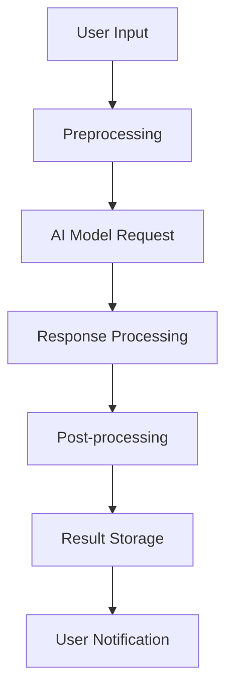

## 🤖 AI Integration Description

A clear description of the AI integration task or enhancement.

## 🎯 Integration Objective

What specific AI capability do you want to integrate or enhance?

### AI Provider/Model Type
- [ ] Anthropic Claude (existing)
- [ ] OpenAI GPT (existing)
- [ ] Custom AI Model
- [ ] Multi-Model Integration
- [ ] Local LLM Setup
- [ ] Fine-tuning Required
- [ ] Other: ____________

## 📋 Technical Requirements

**API Integration:**
- [ ] New API key configuration
- [ ] Rate limiting setup
- [ ] Error handling implementation
- [ ] Retry logic needed
- [ ] Cost monitoring

**Data Processing:**
- [ ] Input validation and sanitization
- [ ] Output formatting and validation
- [ ] Context management
- [ ] Prompt engineering
- [ ] Response caching

**Performance Requirements:**
- [ ] Response time: <2 seconds
- [ ] Concurrent request handling
- [ ] Batch processing capability
- [ ] Queue management
- [ ] Resource optimization

## 🔧 Integration Components

**Backend Changes:**
- [ ] New service/module creation
- [ ] Database schema modifications
- [ ] API endpoint creation
- [ ] Authentication integration
- [ ] Logging and monitoring
- [ ] Error tracking

**Frontend Changes:**
- [ ] UI component development
- [ ] Real-time updates
- [ ] Progress indicators
- [ ] Error handling UI
- [ ] Settings/configuration UI
- [ ] User feedback collection

**Security Considerations:**
- [ ] API key management
- [ ] Data encryption at rest
- [ ] Data encryption in transit
- [ ] Input validation
- [ ] Output sanitization
- [ ] Rate limiting per user
- [ ] Audit logging

## 📊 Integration Scope

**WorkshopAI CMS Modules:**
- [ ] Content Generation
- [ ] Workshop Assistant
- [ ] Questionnaire Analysis
- [ ] Document Processing
- [ ] User Support Chat
- [ ] Data Analysis
- [ ] Email Automation
- [ ] Translation Services
- [ ] Image/Video Processing
- [ ] Code Generation/Review
- [ ] Other: ____________

**Integration Workflow:**

## 🧪 Testing Strategy

**Functional Testing:**
- [ ] Unit tests for new components
- [ ] Integration tests with AI providers
- [ ] End-to-end workflow tests
- [ ] Error scenario testing
- [ ] Performance load testing

**Quality Assurance:**
- [ ] Output accuracy validation
- [ ] Response time benchmarks
- [ ] Cost analysis monitoring
- [ ] User acceptance testing
- [ ] A/B testing framework

## 📈 Success Metrics

**Performance Metrics:**
- [ ] Response time < target
- [ ] Error rate < threshold
- [ ] Throughput targets
- [ ] Resource utilization
- [ ] Cost per request

**Quality Metrics:**
- [ ] User satisfaction scores
- [ ] Output accuracy rates
- [ ] Feature adoption rates
- [ ] Support ticket reduction
- [ ] Task completion rates

## 🔗 Dependencies

**External Services:**
- [ ] Anthropic API access
- [ ] OpenAI API access
- [ ] Custom model endpoints
- [ ] Database connections
- [ ] Cache services (Redis)
- [ ] Monitoring services

**Internal Dependencies:**
- [ ] Existing AI modules
- [ ] Authentication system
- [ ] Database schemas
- [ ] API contracts
- [ ] Frontend components
- [ ] Testing infrastructure

## 🚨 Risk Assessment

**Technical Risks:**
- [ ] API rate limiting
- [ ] Model availability
- [ ] Response quality degradation
- [ ] Cost overruns
- [ ] Performance bottlenecks

**Operational Risks:**
- [ ] Service downtime
- [ ] Data privacy concerns
- [ ] Regulatory compliance
- [ ] User experience impact
- [ ] Maintenance overhead

## 💰 Cost Analysis

**Expected Monthly Costs:**
- API calls: $_______
- Storage: $_______
- Processing: $_______
- Monitoring: $_______
- **Total: $_______**

**Cost Optimization:**
- [ ] Response caching
- [ ] Batch processing
- [ ] Request deduplication
- [ ] Model selection
- [ ] Usage monitoring

## 📋 Implementation Timeline

**Phase 1 - Development (X days):**
- [ ] API integration setup
- [ ] Core functionality implementation
- [ ] Basic testing framework
- [ ] Documentation

**Phase 2 - Testing (Y days):**
- [ ] Comprehensive testing
- [ ] Performance optimization
- [ ] Security validation
- [ ] User acceptance testing

**Phase 3 - Deployment (Z days):**
- [ ] Production deployment
- [ ] Monitoring setup
- [ ] User training
- [ ] Documentation updates

## 🤝 Additional Context

Add any relevant context, examples, or specific requirements.

## 📎 Supporting Documents

- [ ] API documentation
- [ ] Model specifications
- [ ] Architecture diagrams
- [ ] User requirements
- [ ] Technical specifications

---

## 🤖 AI Swarm Processing

This integration task will be processed by our specialized AI swarm agents:

1. **Integration Analysis**: Compatibility assessment with existing AI modules
2. **Architecture Planning**: System design and component mapping
3. **Security Review**: Data protection and compliance validation
4. **Performance Planning**: Resource allocation and optimization
5. **Implementation Coordination**: Task breakdown and agent assignment

**Specialized Agents Assigned:**
- `ml-developer`: AI/ML implementation
- `backend-dev`: API and service integration
- `security-manager`: Security and compliance
- `performance-optimizer`: Performance optimization
- `documentation-specialist`: Technical documentation

**Expected Processing Time**: 24-72 hours based on complexity
**Priority**: High for core AI enhancements, Medium for experimental features