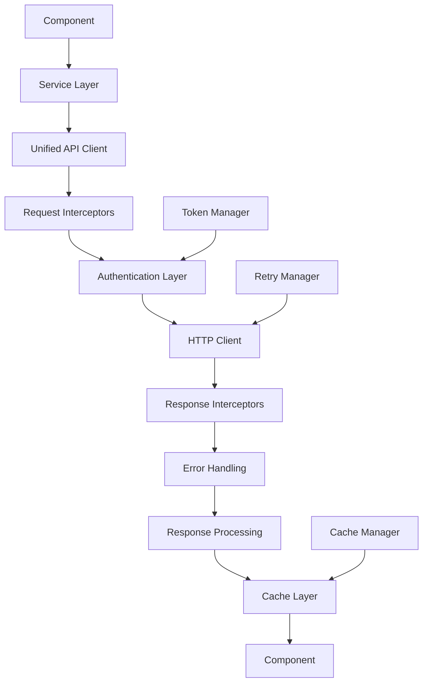
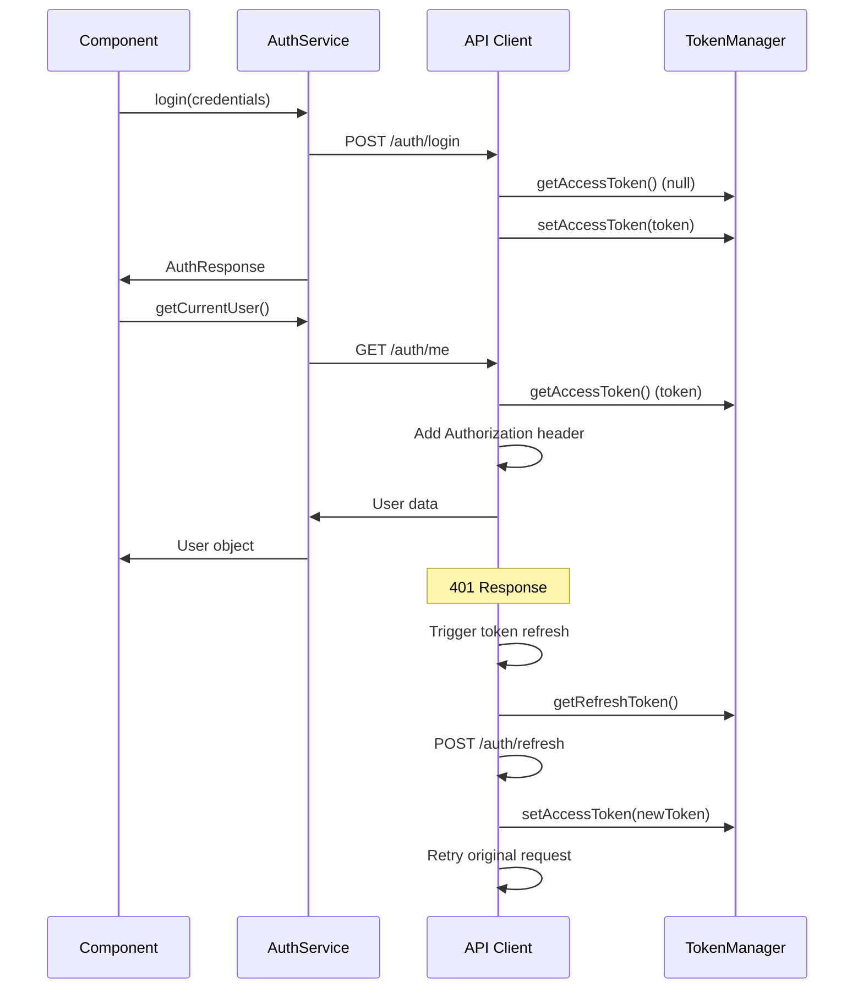

# WorkshopsAI CMS - Unified API Documentation

## Table of Contents

1. [Overview](#overview)
2. [Architecture](#architecture)
3. [Configuration](#configuration)
4. [Authentication](#authentication)
5. [API Endpoints](#api-endpoints)
6. [Error Handling](#error-handling)
7. [Caching Strategy](#caching-strategy)
8. [Rate Limiting & Performance](#rate-limiting--performance)
9. [TypeScript Integration](#typescript-integration)
10. [Usage Examples](#usage-examples)
11. [Testing](#testing)
12. [Migration Guide](#migration-guide)

## Overview

The WorkshopsAI CMS uses a unified API client architecture that provides:

- **Centralized Configuration**: Single source of truth for API settings
- **Consistent Authentication**: JWT-based auth with automatic token refresh
- **Intelligent Caching**: Request deduplication and configurable caching
- **Robust Error Handling**: Standardized error responses and retry logic
- **Performance Optimization**: Connection pooling and request batching
- **Type Safety**: Full TypeScript support with auto-generated types

### Key Features

- ✅ **Unified Configuration**: All API settings in one place
- ✅ **Automatic Token Management**: Refresh tokens on 401 errors
- ✅ **Request Caching**: Configurable caching per service type
- ✅ **Retry Logic**: Exponential backoff with smart retry conditions
- ✅ **Error Formatting**: Consistent error structure across all services
- ✅ **Performance Monitoring**: Built-in request timing and logging
- ✅ **File Upload Support**: Progress tracking and optimized uploads
- ✅ **Service-specific Config**: Optimized settings per service type

## Architecture

### Directory Structure

```
frontend/src/
├── lib/                           # Core API infrastructure
│   ├── api-config.ts             # Configuration & endpoints
│   └── api-client.ts             # Unified API client
├── services/                      # Service implementations
│   ├── auth-service.ts           # Authentication service
│   ├── workshop-service.ts       # Workshop management
│   ├── dashboard-service.ts      # Dashboard & analytics
│   └── questionnaire-service.ts  # Questionnaire management
├── utils/                         # Utilities
│   └── authTokens.ts              # Token management (legacy)
```

### Flow Diagram



## Configuration

### Environment Variables

```bash
# API Configuration
VITE_API_URL=https://api.workshopsai.com/api    # Production API
VITE_API_URL=/api                              # Development with proxy
VITE_ENABLE_API_LOGGING=true                   # Development logging
```

### Default Configuration

```typescript
export const DEFAULT_API_CONFIG = {
  baseURL: import.meta.env.VITE_API_URL || '/api',
  timeout: 30000,           // 30 seconds
  retryAttempts: 3,        // Retry failed requests 3 times
  retryDelay: 1000,        // 1 second base delay
  enableCache: true,        // Enable request caching
  enableLogging: import.meta.env.DEV  // Log in development
};
```

### Service-Specific Configurations

```typescript
export const SERVICE_CONFIGS = {
  auth: {
    timeout: 15000,         // Faster timeout for auth
    retryAttempts: 2,       // Less retry for auth
    enableCache: false      // Never cache auth requests
  },
  workshops: {
    timeout: 30000,         // Longer for large data
    retryAttempts: 3,
    enableCache: true       // Cache workshop data
  },
  dashboard: {
    timeout: 20000,
    retryAttempts: 2,
    enableCache: true       // Brief cache for dashboard
  },
  upload: {
    timeout: 60000,         // Long timeout for uploads
    retryAttempts: 1,       // Minimal retry for uploads
    enableCache: false      // Never cache uploads
  }
};
```

## Authentication

### JWT Token Management

The unified API client automatically handles:

- **Token Storage**: Secure token storage using TokenManager
- **Token Refresh**: Automatic refresh on 401 errors
- **Token Cleanup**: Clear tokens on logout/refresh failure
- **Cross-tab Sync**: Token changes synced across browser tabs

### Authentication Flow



### Usage Examples

```typescript
import { authService } from '@/services/auth-service';

// Login
const login = async (credentials: LoginCredentials) => {
  try {
    const { user, accessToken } = await authService.login(credentials);
    console.log('Logged in as:', user.email);
  } catch (error: any) {
    console.error('Login failed:', error.message);
  }
};

// Check authentication status
const checkAuth = async () => {
  const isAuth = await authService.isAuthenticated();
  const user = await authService.getCurrentUser();

  if (isAuth && user) {
    console.log('User is authenticated:', user.role);
  }
};

// Role-based access
const canCreateWorkshop = authService.canCreateWorkshops();
const canManageUsers = authService.canManageUsers();
```

## API Endpoints

### Base URL Configuration

```typescript
// Development (with Vite proxy)
baseURL: '/api'  // Rewritten to '/api/v1' by proxy

// Production
baseURL: 'https://api.workshopsai.com/api'
```

### Available Endpoints

#### Authentication Endpoints

```typescript
const AUTH_ENDPOINTS = {
  LOGIN: '/auth/login',
  REGISTER: '/auth/register',
  LOGOUT: '/auth/logout',
  REFRESH: '/auth/refresh',
  ME: '/auth/me',
  FORGOT_PASSWORD: '/auth/forgot-password',
  RESET_PASSWORD: '/auth/reset-password'
};
```

#### Workshop Endpoints

```typescript
const WORKSHOP_ENDPOINTS = {
  LIST: '/workshops',
  CREATE: '/workshops',
  UPDATE: (id: string) => `/workshops/${id}`,
  DELETE: (id: string) => `/workshops/${id}`,
  PUBLISH: (id: string) => `/workshops/${id}/publish`,
  CHECKLIST: (id: string) => `/workshops/${id}/publish-checklist`,
  SESSIONS: (workshopId: string) => `/workshops/${workshopId}/sessions`,
  MODULES: (workshopId: string, sessionId: string) =>
    `/workshops/${workshopId}/sessions/${sessionId}/modules`
};
```

#### Dashboard Endpoints

```typescript
const DASHBOARD_ENDPOINTS = {
  METRICS: '/dashboard/metrics',
  ANALYTICS: '/dashboard/analytics',
  ACTIVITY: '/dashboard/activity',
  EXPORT: '/dashboard/analytics/export'
};
```

## Error Handling

### Error Structure

All API errors follow a consistent structure:

```typescript
interface ApiError {
  message: string;          // Human-readable error message
  code?: string;            // Machine-readable error code
  status?: number;          // HTTP status code
  details?: any;            // Additional error details
  timestamp: string;        // Error timestamp
  requestId?: string;       // Request tracking ID
}
```

### Error Types

1. **Network Errors**
   ```typescript
   {
     message: "Network error. Please check your connection.",
     status: undefined,
     timestamp: "2024-01-15T10:30:00.000Z"
   }
   ```

2. **Server Errors (4xx/5xx)**
   ```typescript
   {
     message: "Workshop not found",
     status: 404,
     code: "WORKSHOP_NOT_FOUND",
     details: { workshopId: "invalid-id" },
     timestamp: "2024-01-15T10:30:00.000Z",
     requestId: "req_1234567890_abcdef123"
   }
   ```

3. **Validation Errors**
   ```typescript
   {
     message: "Validation failed",
     status: 422,
     details: {
       email: "Invalid email format",
       password: "Password must be at least 8 characters"
     },
     timestamp: "2024-01-15T10:30:00.000Z"
   }
   ```

### Error Handling Patterns

```typescript
// Basic error handling
try {
  const workshop = await workshopService.getWorkshop(id);
} catch (error: any) {
  console.error('Error:', error.message);

  // Show user-friendly message
  if (error.status === 404) {
    showMessage('Workshop not found');
  } else if (error.status === 403) {
    showMessage('You do not have permission');
  } else {
    showMessage('An error occurred. Please try again.');
  }
}

// Advanced error handling with details
try {
  await workshopService.createWorkshop(data);
} catch (error: any) {
  if (error.details) {
    // Handle validation errors
    Object.entries(error.details).forEach(([field, message]) => {
      setFieldError(field, message as string);
    });
  } else {
    // Handle other errors
    showError(error.message);
  }
}
```

## Caching Strategy

### Cache Configuration

```typescript
interface CacheConfig {
  enable: boolean;          // Enable/disable caching
  ttl: number;              // Time to live in milliseconds
  keyGenerator: (config) => string;  // Custom cache key
}
```

### Service-Specific Caching

| Service Type | Cache Enabled | TTL | Key Pattern |
|--------------|---------------|-----|-------------|
| `auth`       | ❌ Never cache | N/A | N/A |
| `workshops`  | ✅ Yes | 5 minutes | `GET:/workshops:{params}` |
| `dashboard`  | ✅ Yes | 1 minute | `GET:/dashboard/*` |
| `upload`     | ❌ Never cache | N/A | N/A |

### Cache Management

```typescript
import { apiClient } from '@/lib/api-client';

// Clear all cache
apiClient.clearCache();

// Clear specific pattern
apiClient.clearCache('workshops');

// Bypass cache for specific request
const workshops = await workshopService.getWorkshops(filters, {
  skipCache: true
});

// Force refresh
apiClient.clearCache('dashboard');
const metrics = await dashboardService.getMetrics();
```

## Rate Limiting & Performance

### Request Optimization

1. **Request Deduplication**
   ```typescript
   // Multiple identical requests get deduplicated
   const promise1 = workshopService.getWorkshop('123');
   const promise2 = workshopService.getWorkshop('123');
   // Both promises resolve with same request
   ```

2. **Retry Logic**
   ```typescript
   // Automatic retry with exponential backoff
   // 1st retry: 1s + random jitter
   // 2nd retry: 2s + random jitter
   // 3rd retry: 4s + random jitter
   ```

3. **Connection Pooling**
   ```typescript
   // Automatic connection reuse
   // Optimized for browser limits (6 connections per domain)
   ```

### Performance Monitoring

```typescript
// Built-in performance tracking
interface RequestMetadata {
  startTime: number;
  requestId: string;
  duration?: number;
  cacheHit?: boolean;
  retryCount?: number;
}

// Automatic logging in development
[API Request] GET /workshops { requestId: "req_123", headers: { Authorization: "Bearer [REDACTED]" } }
[API Response] 200 GET /workshops { duration: "245ms", requestId: "req_123" }
```

### Service-Specific Optimization

```typescript
// Auth requests: Fast, no cache, minimal retry
const authConfig = { timeout: 15000, retryAttempts: 2, enableCache: false };

// Workshop requests: Slower, cached, more retry
const workshopConfig = { timeout: 30000, retryAttempts: 3, enableCache: true };

// Upload requests: Slow, no cache, minimal retry
const uploadConfig = { timeout: 60000, retryAttempts: 1, enableCache: false };
```

## TypeScript Integration

### Type Safety

All API responses are fully typed:

```typescript
// Workshop types
interface Workshop {
  id: string;
  slug: string;
  titleI18n: Record<string, string>;
  status: 'draft' | 'published' | 'archived';
  // ... full type definition
}

// API response wrapper
interface ApiResponse<T> {
  success: boolean;
  message: string;
  data: T;
  meta?: ResponseMetadata;
}

// Service methods return typed data
const workshops: Workshop[] = await workshopService.getWorkshops();
const workshop: Workshop = await workshopService.getWorkshop('123');
```

### Generic API Methods

```typescript
// Direct API client usage with types
const workshops = await apiClient.get<Workshop[]>('/workshops');
const workshop = await apiClient.post<Workshop>('/workshops', data);

// Custom types for your API
interface CustomResponse {
  items: CustomItem[];
  total: number;
}

const result = await apiClient.get<CustomResponse>('/custom-endpoint');
```

### Type Guards

```typescript
// Type guards for runtime checking
function isApiError(error: any): error is ApiError {
  return error && typeof error.message === 'string' && typeof error.timestamp === 'string';
}

function isWorkshop(data: any): data is Workshop {
  return data && typeof data.id === 'string' && typeof data.slug === 'string';
}
```

## Usage Examples

### Basic Usage

```typescript
import { workshopService, dashboardService } from '@/services';

// Get workshops with filtering
const workshops = await workshopService.getWorkshops({
  status: 'published',
  page: 1,
  limit: 20,
  sortBy: 'updatedAt',
  sortOrder: 'desc'
});

// Create new workshop
const newWorkshop = await workshopService.createWorkshop({
  slug: 'new-workshop',
  titleI18n: { en: 'New Workshop', pl: 'Nowe Warsztaty' },
  descriptionI18n: { en: 'Description', pl: 'Opis' },
  facilitatorId: 'user-123',
  status: 'draft'
});
```

### Advanced Usage

```typescript
// File upload with progress
const uploadImage = async (file: File) => {
  try {
    const result = await workshopService.uploadImage(file, (progress) => {
      console.log(`Upload progress: ${progress}%`);
    });
    return result.url;
  } catch (error: any) {
    console.error('Upload failed:', error.message);
    throw error;
  }
};

// Dashboard analytics with caching
const getDashboardData = async () => {
  const [metrics, analytics, activity] = await Promise.all([
    dashboardService.getMetrics(),
    dashboardService.getAnalytics({ period: 'month' }),
    dashboardService.getActivity(10)
  ]);

  return { metrics, analytics, activity };
};

// Workshop export
const exportWorkshop = async (workshopId: string) => {
  const blob = await workshopService.exportWorkshop(workshopId, 'pdf');

  // Download file
  const url = URL.createObjectURL(blob);
  const a = document.createElement('a');
  a.href = url;
  a.download = `workshop-${workshopId}.pdf`;
  document.body.appendChild(a);
  a.click();
  document.body.removeChild(a);
  URL.revokeObjectURL(url);
};
```

### Error Handling

```typescript
// Comprehensive error handling
const handleWorkshopOperation = async () => {
  try {
    const workshop = await workshopService.getWorkshop('123');

    // Validate workshop data
    if (!workshop.titleI18n.en) {
      throw new Error('Workshop title is required');
    }

    return workshop;
  } catch (error: any) {
    console.error('Workshop operation failed:', {
      message: error.message,
      status: error.status,
      details: error.details,
      requestId: error.requestId
    });

    // Show user-friendly error
    if (error.status === 404) {
      showToast('Workshop not found', 'error');
    } else if (error.status === 403) {
      showToast('Access denied', 'error');
    } else {
      showToast('An error occurred. Please try again.', 'error');
    }

    // Re-throw for component error handling
    throw error;
  }
};
```

### Authentication Flow

```typescript
// Complete authentication workflow
const authenticate = async () => {
  try {
    // Check existing session
    const currentUser = await authService.getCurrentUser();
    if (currentUser) {
      console.log('Already authenticated as:', currentUser.email);
      return currentUser;
    }

    // Login with credentials
    const { user, accessToken } = await authService.login({
      email: 'user@example.com',
      password: 'password123',
      rememberMe: true
    });

    // Check user permissions
    if (authService.canCreateWorkshops()) {
      console.log('User can create workshops');
    }

    // Subscribe to auth changes
    const unsubscribe = authService.subscribeToAuthChanges((user) => {
      if (!user) {
        console.log('User logged out');
        // Redirect to login page
        window.location.href = '/login';
      }
    });

    return user;
  } catch (error: any) {
    console.error('Authentication failed:', error.message);
    // Handle authentication error
    throw error;
  }
};
```

## Testing

### Unit Testing

```typescript
// Mock the API client
jest.mock('@/lib/api-client');
const mockApiClient = apiClient as jest.Mocked<typeof apiClient>;

describe('WorkshopService', () => {
  beforeEach(() => {
    jest.clearAllMocks();
  });

  test('should fetch workshops successfully', async () => {
    const mockWorkshops = [
      { id: '1', slug: 'workshop-1', titleI18n: { en: 'Workshop 1' } }
    ];

    mockApiClient.get.mockResolvedValue(mockWorkshops);

    const result = await workshopService.getWorkshops();

    expect(mockApiClient.get).toHaveBeenCalledWith(
      API_ENDPOINTS.WORKSHOPS.LIST,
      {},
      { serviceType: 'workshops', skipCache: false }
    );
    expect(result).toEqual(mockWorkshops);
  });

  test('should handle API errors gracefully', async () => {
    const mockError = {
      message: 'Not found',
      status: 404,
      timestamp: new Date().toISOString()
    };

    mockApiClient.get.mockRejectedValue(mockError);

    await expect(workshopService.getWorkshop('invalid-id'))
      .rejects.toThrow('Not found');
  });
});
```

### Integration Testing

```typescript
// Test with actual API client
describe('API Client Integration', () => {
  test('should handle real API responses', async () => {
    const client = createApiClient({
      baseURL: 'http://localhost:3010/api',
      enableLogging: false
    });

    // Mock server responses
    const mockResponse = { data: { test: 'value' } };
    jest.spyOn(axios, 'request').mockResolvedValue({
      data: mockResponse,
      status: 200
    });

    const result = await client.get('/test');
    expect(result).toEqual(mockResponse);
  });
});
```

### Error Testing

```typescript
test('should format API errors consistently', async () => {
  const axiosError = {
    response: {
      status: 422,
      data: {
        message: 'Validation failed',
        details: {
          email: 'Invalid email',
          password: 'Too short'
        }
      }
    }
  };

  mockApiClient.post.mockRejectedValue(axiosError);

  try {
    await authService.register(invalidData);
  } catch (error: any) {
    expect(error.message).toBe('Validation failed');
    expect(error.status).toBe(422);
    expect(error.details).toEqual({
      email: 'Invalid email',
      password: 'Too short'
    });
  }
});
```

## Migration Guide

### Step-by-Step Migration

1. **Update Imports**
   ```typescript
   // Before
   import { authService } from '@/services/auth';
   import { workshopService } from '@/services/workshop';

   // After
   import { authService } from '@/services/auth-service';
   import { workshopService } from '@/services/workshop-service';
   ```

2. **Update Error Handling**
   ```typescript
   // Before
   catch (error) {
     console.error(error.message);
   }

   // After
   catch (error: any) {
     console.error(error.message, error.status, error.details);
   }
   ```

3. **Enable Caching Benefits**
   ```typescript
   // Automatic caching - no code changes needed
   const workshops = await workshopService.getWorkshops();
   // Second call returns cached result

   // Bypass cache if needed
   const freshWorkshops = await workshopService.getWorkshops(filters, {
     skipCache: true
   });
   ```

4. **Monitor Performance**
   ```typescript
   // Built-in logging in development
   // Watch console for:
   // [API Request] GET /workshops { requestId: "req_123" }
   // [API Response] 200 GET /workshops { duration: "245ms", requestId: "req_123" }
   ```

### Validation Checklist

- [ ] All imports updated to new service files
- [ ] Error handling updated for consistent structure
- [ ] Authentication flow tested
- [ ] Cache behavior verified
- [ ] Performance metrics monitored
- [ ] Error scenarios tested
- [ ] TypeScript compilation successful
- [ ] Unit tests passing
- [ ] Integration tests passing

### Rollback Plan

If issues arise:

1. **Revert imports** to old service files
2. **Check console** for detailed error information
3. **Monitor network** tab for request/response details
4. **Contact support** with error logs and request IDs

---

## API Reference

### Core Classes

#### `ApiClient`

Main API client with unified configuration.

```typescript
class ApiClient {
  constructor(config?: Partial<ApiConfig>);

  // HTTP methods
  get<T>(url: string, params?: any, options?: RequestOptions): Promise<T>;
  post<T>(url: string, data?: any, options?: RequestOptions): Promise<T>;
  put<T>(url: string, data?: any, options?: RequestOptions): Promise<T>;
  patch<T>(url: string, data?: any, options?: RequestOptions): Promise<T>;
  delete<T>(url: string, options?: RequestOptions): Promise<T>;

  // File upload
  upload<T>(url: string, file: File, options?: UploadOptions): Promise<T>;

  // Cache management
  clearCache(pattern?: string): void;

  // Configuration
  updateConfig(newConfig: Partial<ApiConfig>): void;
  getAxiosInstance(): AxiosInstance;
}
```

#### Service Classes

- `AuthService`: Authentication and user management
- `WorkshopService`: Workshop CRUD and operations
- `DashboardService`: Analytics and metrics
- `QuestionnaireService`: Form and response management

### Configuration Interfaces

```typescript
interface ApiConfig {
  baseURL: string;
  timeout: number;
  retryAttempts: number;
  retryDelay: number;
  enableCache: boolean;
  enableLogging: boolean;
}

interface RequestOptions extends AxiosRequestConfig {
  skipCache?: boolean;
  skipRetry?: boolean;
  serviceType?: keyof typeof SERVICE_CONFIGS;
}
```

### Response Types

```typescript
interface ApiResponse<T = any> {
  success: boolean;
  message: string;
  data: T;
  meta?: {
    pagination?: {
      page: number;
      limit: number;
      total: number;
      totalPages: number;
    };
    timestamp: string;
    requestId?: string;
  };
}

interface ApiError {
  message: string;
  code?: string;
  status?: number;
  details?: any;
  timestamp: string;
  requestId?: string;
}
```

---

**Last Updated:** January 2024
**Version:** 1.0.0
**Contact:** development@workshopsai.com