# SOCIOLOGICAL CMS - EXECUTIVE SYNTHESIS PLAN

**Data:** 2025-01-13  
**Wersja:** 1.0 FINAL  
**Status:** Ready for Implementation

---

## TL;DR

Wybrano **hybrydowy wariant A+** łączący stabilność backendu z cmsplan4 (Node.js + PostgreSQL + Cloud Run), rozbudowany model danych z cmsplan5 (COHORT, ATTENDANCE, i18n), oraz pragmatyczny frontend z WORKFLOW (Web Components + progressive enhancement zamiast heavy framework lock-in). System dostarcza no-code CMS dla socjologa, który tworzy warsztaty w <70min z wbudowaną anonimizacją i analizą LLM. MVP w 12 tygodni, 5-osobowy zespół, budżet ~€40k.

---

## 1. NORMALIZED INPUTS

### 1.1 Założenia Biznesowe
| Parametr | Wartość | Źródło |
|----------|---------|--------|
| **User persona** | Socjolog-editor bez wiedzy technicznej | Requirements |
| **Time-to-publish** | <70 min dla warsztatu z kwestionariuszem | cmsplan3 KPI |
| **Scale (Year 1)** | 50 warsztatów, 500 uczestników, 2000 odpowiedzi/miesiąc | Conservative estimate |
| **Horyzont MVP** | 12 tygodni | WORKFLOW_IMPLEMENTATION_PLAN |
| **Zespół** | 5 FTE: 1 Architect, 2 Backend, 1 Frontend, 1 DevOps+QA | WORKFLOW |
| **Budżet (infra/rok)** | ~€500/msc (Cloud Run + managed DB + Redis + storage) | Google Cloud pricing |
| **Budżet (dev/3msc)** | ~€40k (5 FTE @ €8k/FTE) | Mid-tier EU rates |

### 1.2 Constraints Techniczne
| Constraint | Value | Reasoning |
|------------|-------|-----------|
| **Backend stack** | Node.js 20+, TypeScript 5+ | Ecosystem maturity, team skills |
| **Database** | PostgreSQL 15+ (managed) | RLS policies, JSONB, audit capability |
| **ORM** | Drizzle v0.30+ | Type-safety, migrations, no heavy abstraction |
| **Frontend** | Web Components + TypeScript | Longevity > framework churn |
| **Auth** | JWT (access 15min + refresh 7d) | Stateless, scalable |
| **LLM** | OpenAI/Anthropic via worker queue | Async, cost control |
| **Hosting** | PaaS (Cloud Run, Vercel Edge) | Zero-ops, auto-scale |

### 1.3 Compliance & Legal
| Requirement | Implementation | Verification |
|-------------|----------------|--------------|
| **GDPR/RODO Art. 5** | Data minimization, purpose limitation | Privacy Impact Assessment (PIA) |
| **Consent (Art. 7)** | Explicit opt-in, granular (research/marketing) | Audit log of consent changes |
| **Right to erasure (Art. 17)** | Soft delete + 90-day hard purge job | Automated DSR workflow |
| **Anonymization** | Hash PII before LLM send, k-anonymity k≥5 | Unit tests, penetration test |
| **WCAG 2.2 AA** | Contrast 4.5:1, keyboard nav, ARIA | Axe-core in CI, manual audit |

### 1.4 SLOs & Budgets
| Metric | Target | Measurement |
|--------|--------|-------------|
| **Uptime** | 99.9% (43min downtime/month) | Synthetic monitoring (Pingdom) |
| **API latency P95** | <400ms (excl. external LLM) | OpenTelemetry traces |
| **Page TTFB P95** | <600ms | RUM (Real User Monitoring) |
| **Error budget** | 0.1% (864 failed req/day @ 10k rpm) | Prometheus alerts |
| **Data retention** | Responses: 5 years, Audit: 10 years | Compliance requirement |

---

## 2. DECISION MATRIX

### 2.1 Warianty do Oceny

**Wariant A (cmsplan4):** Next.js frontend + Node.js API + PostgreSQL + Cloud Run  
**Wariant B (WORKFLOW):** Vanilla JS + Express + Drizzle + MySQL + Docker  
**Wariant C (cmsplan5):** Rozbudowany ERD (COHORT, ATTENDANCE, i18n) + headless  
**Wariant D (cmsplan1/2/3):** Minimalist headless, focuses on Questionnaire  

### 2.2 Weighted Scoring

| Criteria | Weight | A | B | C | D | Rationale |
|----------|--------|---|---|---|---|-----------|
| **Research Rigor** (audit trail, versioning, reversibility) | 20% | 8 | 9 | 10 | 7 | C has full audit + soft delete + schema versioning |
| **Ethical/Legal Risk** (GDPR, anonymization, RLS) | 20% | 9 | 8 | 10 | 8 | C explicitly models CONSENTS, A has RLS |
| **Sociologist UX** (no-code, WYSIWYG, time-to-publish) | 15% | 7 | 6 | 6 | 8 | D simplest but lacks i18n; A has good DX |
| **Data Quality/Analytics** (LLM integration, export) | 10% | 8 | 7 | 8 | 9 | D+A have clear LLM worker patterns |
| **Maintainability** (docs, patterns, team skills) | 10% | 7 | 9 | 7 | 6 | B best documented, A vendor-locked to Vercel |
| **Extensibility** (plugins, schema evolution, APIs) | 10% | 8 | 9 | 10 | 7 | C most modular (COHORT decouples workshops) |
| **Cost** (infra, dev time, ops) | 8% | 6 | 8 | 7 | 8 | B cheapest (self-hosted), A mid, C adds complexity |
| **Time-to-Impact** (MVP speed, iterability) | 7% | 9 | 7 | 6 | 8 | A fastest (PaaS), C slowest (most tables) |

#### Computed Scores
- **A:** (8×0.2 + 9×0.2 + 7×0.15 + 8×0.1 + 7×0.1 + 8×0.1 + 6×0.08 + 9×0.07) = **7.86**
- **B:** (9×0.2 + 8×0.2 + 6×0.15 + 7×0.1 + 9×0.1 + 9×0.1 + 8×0.08 + 7×0.07) = **8.03**
- **C:** (10×0.2 + 10×0.2 + 6×0.15 + 8×0.1 + 7×0.1 + 10×0.1 + 7×0.08 + 6×0.07) = **8.38** ⭐
- **D:** (7×0.2 + 8×0.2 + 8×0.15 + 9×0.1 + 6×0.1 + 7×0.1 + 8×0.08 + 8×0.07) = **7.60**

### 2.3 Trade-off Analysis

**C wins** ale ma najdłuższy time-to-market. **Hybrid A+C** = weź strukturę danych z C (COHORT, i18n, ATTENDANCE), infrastrukturę z A (Cloud Run, managed Postgres), i frontend philosophy z B (Web Components > framework lock-in).

**Uzasadnienie:**
1. **Model C:** Research-grade (audit, consent, versioning)
2. **Infra A:** Zero-ops, auto-scale, developer ergonomics
3. **Frontend B:** No React/Vue/Svelte lock-in = długoterminowa stabilność
4. **Odrzucamy:** MySQL (B) → PostgreSQL (A) bo RLS + JSONB + extensions (pg_cron, pgvector future)

---

## 3. TARGET ARCHITECTURE (Hybrid A+C)

### 3.1 System Context

```mermaid
C4Context
    title System Context - WorkshopsAI CMS

    Person(sociologist, "Socjolog-Editor", "Tworzy warsztaty, analizuje")
    Person(participant, "Uczestnik", "Zapisuje się, wypełnia kwestionariusze")
    Person(facilitator, "Facylitator", "Prowadzi sesje")

    System(cms, "CMS System", "Headless CMS + WebApp + Worker")

    System_Ext(llm, "LLM Provider", "OpenAI/Anthropic")
    System_Ext(email, "Email Service", "SendGrid/Mailgun")
    System_Ext(storage, "Object Storage", "GCS/S3")

    Rel(sociologist, cms, "Zarządza treścią", "HTTPS/REST")
    Rel(participant, cms, "Uczestniczy", "HTTPS/REST")
    Rel(facilitator, cms, "Prowadzi sesje", "HTTPS/REST")
    Rel(cms, llm, "Analizuje odpowiedzi", "HTTPS/REST")
    Rel(cms, email, "Wysyła powiadomienia", "SMTP/API")
    Rel(cms, storage, "Przechowuje media", "S3 API")
```



### 3.2 Component Diagram


### 3.3 Deployment Diagram


### 3.4 Rationale for Choices

| Decision | Alternative Rejected | Why |
|----------|---------------------|-----|
| **PostgreSQL over MySQL** | MySQL (from WORKFLOW) | RLS policies, JSONB, pgvector (future), stronger typing |
| **Cloud Run over Docker self-hosted** | Self-hosted (WORKFLOW) | Zero-ops, auto-scale, SLA 99.95%, managed certs |
| **Web Components over React** | Next.js Client Components | No framework churn, standards-based, 5-year horizon |
| **Drizzle over Prisma** | Prisma | Lighter, migrations as SQL, no generated bloat |
| **BullMQ over custom queue** | SQS/PubSub | Battle-tested, built-in retries, UI (bull-board) |

---

## 4. CMS DESIGN PRINCIPLES

### 4.1 Core Tenets

1. **Simplicity-First:** Editor interface = 3 clicks to publish (Create → Fill → Publish). Zero technical jargon.
2. **Privacy-by-Design:** RLS policies enforce data access, k-anonymity before LLM, consent table tracks opt-ins.
3. **Research-Grade:** Audit log for every CUD, schema versioning (Alembic-style migrations), export to ODS preserves metadata.
4. **Reversibility:** Soft deletes everywhere, 90-day purge window, rollback via audit diff.
5. **Progressive Disclosure:** Advanced features (i18n, cohorts, attendance) hidden behind feature flags initially.

### 4.2 Anti-Patterns to Avoid

| Anti-Pattern | Why Bad | How We Avoid |
|--------------|---------|--------------|
| **Monolithic form** | Cognitive overload for sociologist | Multi-step wizard, autosave per step |
| **Hard delete** | Data loss, no audit trail | Soft delete + `deleted_at`, purge job |
| **Inline SQL** | SQL injection, hard to test | Drizzle prepared statements, parameterized |
| **Session state in memory** | Doesn't scale horizontally | JWT + Redis for refresh tokens |
| **Blocking LLM calls** | Timeout, poor UX | Worker queue, webhook callback |

### 4.3 UX Flow (Sociologist Creates Workshop)

```mermaid
sequenceDiagram
    actor S as Socjolog
    participant CMS as CMS UI
    participant API as API Server
    participant DB as PostgreSQL

    S->>CMS: Kliknij "Nowy Warsztat"
    CMS->>S: Pokaż formularz (tytuł, daty, opis)
    S->>CMS: Wypełnij + "Dalej"
    CMS->>API: POST /workshops {draft: true}
    API->>DB: INSERT INTO workshops (status=DRAFT)
    DB-->>API: workshop_id
    API-->>CMS: {workshop_id, slug}
    CMS->>S: Przejdź do edytora sekcji

    S->>CMS: Przeciągnij blok "Kwestionariusz"
    CMS->>S: Pokaż kreator pytań
    S->>CMS: Dodaj 5 pytań (text, scale, choice)
    CMS->>API: POST /workshops/{id}/questionnaires
    API->>DB: INSERT INTO questionnaires + questions
    DB-->>API: OK
    API-->>CMS: {questionnaire_id}

    S->>CMS: Kliknij "Podgląd"
    CMS->>API: GET /workshops/{slug}?preview=true
    API->>DB: SELECT (even if status=DRAFT)
    DB-->>API: workshop + sessions + questionnaire
    API-->>CMS: JSON payload
    CMS->>S: Renderuj preview w modal

    S->>CMS: Kliknij "Publikuj"
    CMS->>API: PATCH /workshops/{id} {status: PUBLISHED}
    API->>DB: Checklist: (has_sessions? has_questionnaire? wcag_valid?)
    alt Checklist fail
        API-->>CMS: 422 Unprocessable Entity {errors}
        CMS->>S: Pokaż brakujące elementy
    else Checklist pass
        DB-->>API: UPDATE status=PUBLISHED, published_at=NOW()
        API-->>CMS: 200 OK
        CMS->>S: "Warsztat opublikowany! 🎉"
    end
```



---

## 5. MVP SCOPE (12 WEEKS)

### 5.1 Essential Content Types

| Entity | Fields (core only) | Relations | MVP Priority |
|--------|-------------------|-----------|--------------|
| **User** | id, email, role, created_at, deleted_at | → Enrollment, Response, Consent | P0 |
| **Workshop** | id, title_i18n, description_i18n, status, published_at, deleted_at | → Session, Questionnaire, Enrollment | P0 |
| **Session** | id, workshop_id, title_i18n, start_time, duration_min, location_id | → Module, Attendance | P1 |
| **Module** | id, session_id, type, content_i18n, sort_order | (polymorphic: text, video, quiz) | P1 |
| **Questionnaire** | id, workshop_id, title_i18n | → QuestionGroup | P0 |
| **QuestionGroup** | id, questionnaire_id, title_i18n, sort_order | → Question | P0 |
| **Question** | id, group_id, text_i18n, type, options_i18n, is_required | → Response | P0 |
| **Response** | id, user_id, question_id, value, created_at | | P0 |
| **LLMAnalysis** | id, questionnaire_id, status, report_data, created_at | | P0 |
| **Consent** | id, user_id, consent_type, granted, created_at | | P0 |
| **Enrollment** | id, user_id, workshop_id, status, form_data (encrypted), enrolled_at | | P1 |
| **AuditLog** | id, user_id, table_name, record_id, operation, diff, timestamp | | P1 |
| **Cohort** | id, workshop_id, code, start_date, end_date, max_participants | → Enrollment | P2 (MVP nice-to-have) |
| **Attendance** | id, enrollment_id, session_id, present, checked_at | | P2 |

**P0 = Week 1-6, P1 = Week 7-10, P2 = Week 11-12 (if time)**

### 5.2 Core Flows

#### Flow 1: Sociologist Publishes Workshop (P0)
1. Login → Dashboard → "Create Workshop"
2. Fill metadata (title, dates, description)
3. Add Session (drag-and-drop or modal form)
4. Add Questionnaire template (predefined or blank)
5. Customize questions (WYSIWYG editor)
6. Preview → Publish (checklist validation)

#### Flow 2: Participant Enrolls & Completes Questionnaire (P0)
1. Browse /workshops → Select workshop → Click "Enroll"
2. Fill enrollment form (name, email, consent checkboxes)
3. Receive confirmation email
4. Access /my-workshops → Click questionnaire link
5. Fill questionnaire (auto-save every 30s)
6. Submit → See "Thank you" message

#### Flow 3: LLM Analysis (P0)
1. Sociologist navigates to workshop → "Analyze Responses"
2. System enqueues job → Worker picks up
3. Worker: Fetch responses, anonymize (hash user_id, remove PII), build prompt
4. Worker: Call LLM API (OpenAI), parse JSON result
5. Worker: Save to LLMAnalysis table, mark COMPLETED
6. Sociologist refreshes → See report (summary, themes, clusters)

### 5.3 Must-Have RBAC

| Role | Can Create | Can Read | Can Update | Can Delete |
|------|-----------|----------|------------|------------|
| **Participant** | Response (own) | Workshop (published), Session (published), Response (own) | Response (own, if not submitted) | - |
| **Facilitator** | Session (assigned workshops), Announcement | Workshop (assigned), Response (assigned workshops, anonymized) | Session (own), Module (own) | - |
| **Sociologist-Editor** | Workshop, Session, Questionnaire, QuestionGroup, Question | All of above + LLMAnalysis | All of above (own workshops) | Workshop (soft), Session, Questionnaire (own) |
| **Moderator** | Announcement | All except Consent | User (cannot change role), Workshop, Session | Workshop (soft), Response (if violates policy) |
| **Admin** | All | All (including audit logs) | All | All (including hard delete via CLI) |

**Enforcement:** Middleware checks JWT role + RLS policies in Postgres.

---

## 6. DATA MODEL (PostgreSQL)

### 6.1 ERD (Core Tables)


### 6.2 SQL Schema (Key Tables)

```sql
-- File: migrations/001_core_schema.sql

CREATE EXTENSION IF NOT EXISTS "uuid-ossp";
CREATE EXTENSION IF NOT EXISTS "pgcrypto"; -- for encrypt/decrypt

-- Users
CREATE TABLE users (
    id UUID PRIMARY KEY DEFAULT uuid_generate_v4(),
    email TEXT UNIQUE NOT NULL,
    role TEXT NOT NULL DEFAULT 'Participant' CHECK (role IN ('Participant', 'Facilitator', 'Moderator', 'Sociologist-Editor', 'Admin')),
    created_at TIMESTAMPTZ NOT NULL DEFAULT NOW(),
    deleted_at TIMESTAMPTZ
);
CREATE INDEX idx_users_email ON users(email) WHERE deleted_at IS NULL;
CREATE INDEX idx_users_role ON users(role);

-- Workshops
CREATE TABLE workshops (
    id UUID PRIMARY KEY DEFAULT uuid_generate_v4(),
    title_i18n JSONB NOT NULL, -- {"pl": "Tytuł", "en": "Title"}
    description_i18n JSONB,
    status TEXT NOT NULL DEFAULT 'DRAFT' CHECK (status IN ('DRAFT', 'PUBLISHED', 'ARCHIVED')),
    published_at TIMESTAMPTZ,
    created_by UUID REFERENCES users(id),
    created_at TIMESTAMPTZ NOT NULL DEFAULT NOW(),
    deleted_at TIMESTAMPTZ
);
CREATE INDEX idx_workshops_status ON workshops(status) WHERE deleted_at IS NULL;
CREATE INDEX idx_workshops_published_at ON workshops(published_at) WHERE status = 'PUBLISHED';

-- Questionnaires
CREATE TABLE questionnaires (
    id UUID PRIMARY KEY DEFAULT uuid_generate_v4(),
    workshop_id UUID NOT NULL REFERENCES workshops(id) ON DELETE CASCADE,
    title_i18n JSONB NOT NULL,
    created_at TIMESTAMPTZ NOT NULL DEFAULT NOW()
);
CREATE INDEX idx_questionnaires_workshop_id ON questionnaires(workshop_id);

-- Question Groups
CREATE TABLE question_groups (
    id UUID PRIMARY KEY DEFAULT uuid_generate_v4(),
    questionnaire_id UUID NOT NULL REFERENCES questionnaires(id) ON DELETE CASCADE,
    title_i18n JSONB NOT NULL,
    sort_order INT NOT NULL DEFAULT 0,
    created_at TIMESTAMPTZ NOT NULL DEFAULT NOW()
);
CREATE INDEX idx_question_groups_questionnaire_id ON question_groups(questionnaire_id);

-- Questions
CREATE TABLE questions (
    id UUID PRIMARY KEY DEFAULT uuid_generate_v4(),
    group_id UUID NOT NULL REFERENCES question_groups(id) ON DELETE CASCADE,
    text_i18n JSONB NOT NULL,
    type TEXT NOT NULL CHECK (type IN ('text', 'long-text', 'scale', 'single-choice', 'multi-choice')),
    options_i18n JSONB, -- for choice types: [{"pl": "Opcja 1", "en": "Option 1"}]
    is_required BOOLEAN NOT NULL DEFAULT FALSE,
    created_at TIMESTAMPTZ NOT NULL DEFAULT NOW()
);
CREATE INDEX idx_questions_group_id ON questions(group_id);

-- Responses
CREATE TABLE responses (
    id UUID PRIMARY KEY DEFAULT uuid_generate_v4(),
    user_id UUID NOT NULL REFERENCES users(id) ON DELETE CASCADE,
    question_id UUID NOT NULL REFERENCES questions(id) ON DELETE CASCADE,
    value TEXT NOT NULL, -- JSON string for multi-choice
    created_at TIMESTAMPTZ NOT NULL DEFAULT NOW(),
    UNIQUE(user_id, question_id) -- one response per user per question
);
CREATE INDEX idx_responses_user_id ON responses(user_id);
CREATE INDEX idx_responses_question_id ON responses(question_id);

-- RLS: Users can only see their own responses
ALTER TABLE responses ENABLE ROW LEVEL SECURITY;
CREATE POLICY select_own_responses ON responses FOR SELECT
USING (user_id = current_setting('app.current_user_id')::uuid);

-- LLM Analyses
CREATE TABLE llm_analyses (
    id UUID PRIMARY KEY DEFAULT uuid_generate_v4(),
    questionnaire_id UUID NOT NULL REFERENCES questionnaires(id) ON DELETE CASCADE,
    status TEXT NOT NULL DEFAULT 'PENDING' CHECK (status IN ('PENDING', 'PROCESSING', 'COMPLETED', 'FAILED')),
    report_data JSONB, -- {summary, themes: [{name, keywords, sample_quotes}], clusters: [...]}
    error_message TEXT,
    created_at TIMESTAMPTZ NOT NULL DEFAULT NOW(),
    completed_at TIMESTAMPTZ
);
CREATE INDEX idx_llm_analyses_questionnaire_id ON llm_analyses(questionnaire_id);
CREATE INDEX idx_llm_analyses_status ON llm_analyses(status);

-- Consents
CREATE TABLE consents (
    id UUID PRIMARY KEY DEFAULT uuid_generate_v4(),
    user_id UUID NOT NULL REFERENCES users(id) ON DELETE CASCADE,
    consent_type TEXT NOT NULL, -- 'research_analysis', 'marketing_emails', 'data_sharing'
    granted BOOLEAN NOT NULL,
    created_at TIMESTAMPTZ NOT NULL DEFAULT NOW(),
    UNIQUE(user_id, consent_type, created_at) -- allow re-granting/revoking
);
CREATE INDEX idx_consents_user_id ON consents(user_id);

-- Audit Log
CREATE TABLE audit_logs (
    id UUID PRIMARY KEY DEFAULT uuid_generate_v4(),
    user_id UUID REFERENCES users(id),
    table_name TEXT NOT NULL,
    record_id UUID NOT NULL,
    operation TEXT NOT NULL CHECK (operation IN ('CREATE', 'UPDATE', 'DELETE', 'READ')),
    diff JSONB, -- {"old": {...}, "new": {...}}
    timestamp TIMESTAMPTZ NOT NULL DEFAULT NOW()
);
CREATE INDEX idx_audit_logs_record_id ON audit_logs(record_id);
CREATE INDEX idx_audit_logs_timestamp ON audit_logs(timestamp DESC);
```

### 6.3 Indexes & RLS Policies

**Indexes (performance-critical):**
- `users(email)` WHERE deleted_at IS NULL → fast login lookup
- `workshops(status, published_at)` → homepage query
- `responses(user_id, question_id)` → participant dashboard
- `audit_logs(timestamp DESC)` → recent activity view

**RLS Policies (security-critical):**
```sql
-- Participant can only read published workshops
CREATE POLICY read_published_workshops ON workshops FOR SELECT
USING (status = 'PUBLISHED' AND deleted_at IS NULL);

-- Sociologist-Editor can CRUD own workshops
CREATE POLICY crud_own_workshops ON workshops
USING (created_by = current_setting('app.current_user_id')::uuid);

-- Admin bypasses RLS (set via session variable)
ALTER TABLE workshops FORCE ROW LEVEL SECURITY;
-- Then in application: SET app.is_admin = 'true'; when admin user
```

**Note:** `current_setting('app.current_user_id')` is set in middleware after JWT verification:
```typescript
// In API middleware
await db.execute(sql`SET app.current_user_id = ${userId}`);
```

---

## 7. API SPECIFICATION (OpenAPI 3.1)

### 7.1 Core Endpoints

```yaml
openapi: 3.1.0
info:
  title: WorkshopsAI CMS API
  version: 1.0.0
  description: REST API for headless CMS managing workshops, questionnaires, and LLM analysis
servers:
  - url: https://api.workshopsai.example.com/v1
    description: Production
  - url: http://localhost:3001/v1
    description: Local development

components:
  securitySchemes:
    bearerAuth:
      type: http
      scheme: bearer
      bearerFormat: JWT

  schemas:
    Error:
      type: object
      properties:
        error:
          type: object
          properties:
            code: {type: string}
            message: {type: string}
            details: {type: array}
      required: [error]

    Workshop:
      type: object
      properties:
        id: {type: string, format: uuid}
        title_i18n: {type: object}
        description_i18n: {type: object}
        status: {type: string, enum: [DRAFT, PUBLISHED, ARCHIVED]}
        published_at: {type: string, format: date-time, nullable: true}
        created_at: {type: string, format: date-time}
      required: [id, title_i18n, status]

    Questionnaire:
      type: object
      properties:
        id: {type: string, format: uuid}
        workshop_id: {type: string, format: uuid}
        title_i18n: {type: object}
        groups:
          type: array
          items:
            $ref: '#/components/schemas/QuestionGroup'

    QuestionGroup:
      type: object
      properties:
        id: {type: string, format: uuid}
        title_i18n: {type: object}
        sort_order: {type: integer}
        questions:
          type: array
          items:
            $ref: '#/components/schemas/Question'

    Question:
      type: object
      properties:
        id: {type: string, format: uuid}
        text_i18n: {type: object}
        type: {type: string, enum: [text, long-text, scale, single-choice, multi-choice]}
        options_i18n: {type: array, nullable: true}
        is_required: {type: boolean}

    Response:
      type: object
      properties:
        id: {type: string, format: uuid}
        question_id: {type: string, format: uuid}
        value: {type: string}
        created_at: {type: string, format: date-time}

    LLMAnalysis:
      type: object
      properties:
        id: {type: string, format: uuid}
        questionnaire_id: {type: string, format: uuid}
        status: {type: string, enum: [PENDING, PROCESSING, COMPLETED, FAILED]}
        report_data: {type: object, nullable: true}
        created_at: {type: string, format: date-time}

paths:
  /workshops:
    get:
      summary: List published workshops
      tags: [Public]
      parameters:
        - name: status
          in: query
          schema: {type: string, enum: [PUBLISHED, DRAFT]}
        - name: limit
          in: query
          schema: {type: integer, default: 20}
        - name: offset
          in: query
          schema: {type: integer, default: 0}
      responses:
        '200':
          description: OK
          content:
            application/json:
              schema:
                type: object
                properties:
                  data:
                    type: array
                    items: {$ref: '#/components/schemas/Workshop'}
                  meta:
                    type: object
                    properties:
                      total: {type: integer}
                      limit: {type: integer}
                      offset: {type: integer}

    post:
      summary: Create workshop
      tags: [Management]
      security: [{bearerAuth: []}]
      requestBody:
        required: true
        content:
          application/json:
            schema:
              type: object
              properties:
                title_i18n: {type: object, required: true}
                description_i18n: {type: object}
                status: {type: string, enum: [DRAFT, PUBLISHED], default: DRAFT}
      responses:
        '201':
          description: Created
          content:
            application/json:
              schema: {$ref: '#/components/schemas/Workshop'}
        '401': {description: Unauthorized}
        '403': {description: Forbidden (insufficient role)}

  /workshops/{id}:
    parameters:
      - name: id
        in: path
        required: true
        schema: {type: string, format: uuid}

    get:
      summary: Get workshop details
      tags: [Public]
      parameters:
        - name: preview
          in: query
          description: Show draft if user is editor
          schema: {type: boolean, default: false}
      responses:
        '200':
          description: OK
          content:
            application/json:
              schema: {$ref: '#/components/schemas/Workshop'}
        '404': {description: Not found}

    patch:
      summary: Update workshop
      tags: [Management]
      security: [{bearerAuth: []}]
      requestBody:
        content:
          application/json:
            schema:
              type: object
              properties:
                title_i18n: {type: object}
                description_i18n: {type: object}
                status: {type: string, enum: [DRAFT, PUBLISHED, ARCHIVED]}
      responses:
        '200':
          description: Updated
          content:
            application/json:
              schema: {$ref: '#/components/schemas/Workshop'}
        '422':
          description: Unprocessable Entity (checklist failed)
          content:
            application/json:
              schema:
                type: object
                properties:
                  errors:
                    type: array
                    items:
                      type: object
                      properties:
                        field: {type: string}
                        message: {type: string}

    delete:
      summary: Soft delete workshop
      tags: [Management]
      security: [{bearerAuth: []}]
      responses:
        '204': {description: No Content}
        '403': {description: Forbidden}

  /workshops/{id}/questionnaires:
    parameters:
      - name: id
        in: path
        required: true
        schema: {type: string, format: uuid}

    post:
      summary: Create questionnaire for workshop
      tags: [Management]
      security: [{bearerAuth: []}]
      requestBody:
        required: true
        content:
          application/json:
            schema:
              type: object
              properties:
                title_i18n: {type: object, required: true}
                template_id: {type: string, format: uuid, nullable: true}
      responses:
        '201':
          description: Created
          content:
            application/json:
              schema: {$ref: '#/components/schemas/Questionnaire'}

  /questionnaires/{id}:
    get:
      summary: Get questionnaire with questions
      tags: [Public]
      security: [{bearerAuth: []}]
      parameters:
        - name: id
          in: path
          required: true
          schema: {type: string, format: uuid}
      responses:
        '200':
          description: OK
          content:
            application/json:
              schema: {$ref: '#/components/schemas/Questionnaire'}
        '403': {description: Forbidden (not enrolled or not published)}

  /responses:
    post:
      summary: Submit response to question
      tags: [Participant]
      security: [{bearerAuth: []}]
      requestBody:
        required: true
        content:
          application/json:
            schema:
              type: object
              properties:
                question_id: {type: string, format: uuid, required: true}
                value: {type: string, required: true}
      responses:
        '201':
          description: Created
          content:
            application/json:
              schema: {$ref: '#/components/schemas/Response'}
        '409': {description: Conflict (already answered)}

  /analyses:
    post:
      summary: Trigger LLM analysis for questionnaire
      tags: [Management]
      security: [{bearerAuth: []}]
      requestBody:
        required: true
        content:
          application/json:
            schema:
              type: object
              properties:
                questionnaire_id: {type: string, format: uuid, required: true}
      responses:
        '202':
          description: Accepted
          content:
            application/json:
              schema: {$ref: '#/components/schemas/LLMAnalysis'}
        '403': {description: Forbidden (not owner)}

  /analyses/{id}:
    get:
      summary: Get analysis result
      tags: [Management]
      security: [{bearerAuth: []}]
      parameters:
        - name: id
          in: path
          required: true
          schema: {type: string, format: uuid}
      responses:
        '200':
          description: OK
          content:
            application/json:
              schema: {$ref: '#/components/schemas/LLMAnalysis'}
        '404': {description: Not found}
```

### 7.2 Example Requests/Responses

#### POST /workshops
**Request:**
```json
{
  "title_i18n": {"pl": "Warsztat Nie-Utopii", "en": "Non-Utopia Workshop"},
  "description_i18n": {"pl": "Eksploracja przyszłości wspólnot...", "en": "Exploring the future of communities..."},
  "status": "DRAFT"
}
```

**Response (201):**
```json
{
  "id": "550e8400-e29b-41d4-a716-446655440000",
  "title_i18n": {"pl": "Warsztat Nie-Utopii", "en": "Non-Utopia Workshop"},
  "description_i18n": {"pl": "Eksploracja przyszłości wspólnot...", "en": "Exploring the future of communities..."},
  "status": "DRAFT",
  "published_at": null,
  "created_at": "2025-01-13T10:00:00Z"
}
```

#### PATCH /workshops/{id} (Publish)
**Request:**
```json
{
  "status": "PUBLISHED"
}
```

**Response (422 - Checklist Failed):**
```json
{
  "errors": [
    {"field": "sessions", "message": "Workshop must have at least one session"},
    {"field": "questionnaire", "message": "Workshop must have a questionnaire"}
  ]
}
```

#### POST /responses
**Request:**
```json
{
  "question_id": "a1b2c3d4-e5f6-7890-abcd-ef1234567890",
  "value": "Autonomia, zrównoważony rozwój, transparentność"
}
```

**Response (201):**
```json
{
  "id": "b2c3d4e5-f678-90ab-cdef-123456789012",
  "question_id": "a1b2c3d4-e5f6-7890-abcd-ef1234567890",
  "value": "Autonomia, zrównoważony rozwój, transparentność",
  "created_at": "2025-01-13T14:30:00Z"
}
```

---

## 8. IMPLEMENTATION PLAN (12 Weeks)

### 8.1 WBS (Work Breakdown Structure)

| Week | Phase | Epic | Stories | FTE | Dependencies |
|------|-------|------|---------|-----|--------------|
| **1** | Foundation | Dev Environment | Setup Docker, Postgres, Redis, TypeScript config | 1 Backend | - |
| **1** | Foundation | Auth | JWT issuing, refresh token rotation, middleware | 2 Backend | - |
| **1** | Foundation | DB Schema | Migrations 001-003 (users, workshops, questionnaires) | 1 Backend | - |
| **2** | Core API | Workshop CRUD | POST/GET/PATCH/DELETE /workshops, RLS policies | 2 Backend | Week 1 |
| **2** | Core API | Questionnaire CRUD | POST /workshops/{id}/questionnaires, GET /questionnaires/{id} | 2 Backend | Week 1 |
| **3** | Core API | Response Submission | POST /responses, autosave logic, conflict resolution | 2 Backend | Week 2 |
| **3** | Core API | RBAC Enforcement | Middleware checks, audit logging | 1 Backend | Week 1 |
| **4** | Frontend | CMS UI Shell | Login, dashboard, navigation (Web Components) | 1 Frontend | Week 1 |
| **4** | Frontend | Workshop Editor | Form with i18n fields, session manager | 1 Frontend | Week 2 |
| **5** | Frontend | Questionnaire Creator | Drag-and-drop blocks, WYSIWYG, preview modal | 1 Frontend | Week 2, 3 |
| **5** | Worker | LLM Job Queue | BullMQ setup, anonymization logic, OpenAI integration | 1 Backend | Week 3 |
| **6** | Worker | Analysis Worker | Fetch responses, build prompt, parse LLM JSON, save report | 1 Backend | Week 5 |
| **6** | Frontend | Participant View | Browse workshops, enroll, questionnaire form | 1 Frontend | Week 3 |
| **7** | Integration | API ↔ Frontend | Connect CMS UI to API, error handling | 1 Frontend + 1 Backend | Week 2-6 |
| **7** | Integration | Participant Flow E2E | Enroll → Fill questionnaire → Submit | 1 Backend + 1 Frontend | Week 6 |
| **8** | Polish | A11y Audit | Axe-core fixes, keyboard nav, ARIA labels | 1 Frontend | Week 7 |
| **8** | Polish | i18n Finalization | Polish + English strings, fallback logic | 1 Frontend | Week 7 |
| **9** | Testing | Unit Tests | Jest for API endpoints (80% coverage target) | 1 Backend + 1 QA | Week 2-6 |
| **9** | Testing | Integration Tests | Supertest for full flows (workshop creation, response submission) | 1 Backend + 1 QA | Week 7 |
| **10** | Testing | E2E Tests | Playwright for critical paths (publish workshop, analyze) | 1 QA | Week 7 |
| **10** | Testing | Security Audit | OWASP ZAP scan, manual penetration test, fix findings | 1 DevOps + 1 Backend | Week 9 |
| **11** | Deployment | Infra as Code | Terraform for Cloud SQL, Cloud Run, Memorystore | 1 DevOps | - |
| **11** | Deployment | CI/CD Pipeline | GitHub Actions: build → test → deploy → smoke test | 1 DevOps | Week 10 |
| **12** | Deployment | Monitoring Setup | Prometheus, Grafana dashboards, alerting rules | 1 DevOps | Week 11 |
| **12** | Deployment | Production Deploy | Blue-green deploy, rollback plan, stakeholder demo | All team | Week 11 |

### 8.2 Milestones

| Milestone | Week | Deliverable | Success Criteria |
|-----------|------|-------------|------------------|
| **M1: Auth & DB** | 2 | Login works, migrations applied, RLS enforced | User can login, JWT issued, database has 8 core tables |
| **M2: API Core** | 4 | Workshop CRUD + Questionnaire CRUD functional | Postman collection passes all tests, audit log records CUD |
| **M3: Frontend Alpha** | 6 | CMS UI deployed (staging), sociologist can create workshop | Stakeholder demo: create draft workshop with 1 questionnaire in <10min |
| **M4: Participant Flow** | 7 | Participant can enroll, fill questionnaire, submit | End-to-end test passes: signup → enroll → questionnaire → submit |
| **M5: LLM Integration** | 8 | Worker processes analysis job, generates report | Trigger analysis for 50 responses, report contains themes + summary |
| **M6: Production Ready** | 12 | Deployed to prod, monitoring active, docs published | Uptime >99%, P95 latency <400ms, WCAG AA audit passes |

### 8.3 Staffing & FTE Allocation

| Role | Weeks 1-4 | Weeks 5-8 | Weeks 9-12 | Total FTE-Weeks |
|------|-----------|-----------|------------|-----------------|
| **System Architect** | 0.5 | 0.3 | 0.2 | 1.0 |
| **Backend Dev #1** | 1.0 | 1.0 | 0.8 | 2.8 |
| **Backend Dev #2** | 1.0 | 1.0 | 0.5 | 2.5 |
| **Frontend Dev** | 0.8 | 1.0 | 0.5 | 2.3 |
| **DevOps + QA** | 0.3 | 0.5 | 1.0 | 1.8 |
| **Total per phase** | 3.6 | 3.8 | 3.0 | **10.4 FTE-Weeks** |

**Total budget (labor):** 10.4 FTE-weeks ÷ 4 weeks/month ≈ 2.6 FTE-months × €8k/FTE-month ≈ **€20.8k**  
**Contingency (30%):** €6.2k  
**Total labor:** **€27k**

**Infrastructure (12 months, assuming production after Month 3):**
- Cloud Run (API + Worker): €150/month × 12 = €1,800
- Cloud SQL (PostgreSQL, HA): €250/month × 12 = €3,000
- Memorystore Redis: €80/month × 12 = €960
- Cloud Storage: €30/month × 12 = €360
- Networking (egress): €50/month × 12 = €600
- **Total infra:** **€6,720**

**External services (Year 1):**
- OpenAI API (LLM): ~€500 (assuming 1000 analyses @ $0.50 each)
- SendGrid/Mailgun (emails): €200
- Domain + SSL: €50
- **Total services:** **€750**

**Grand Total (MVP + Year 1 ops):** €27k + €6.7k + €0.75k = **€34.45k** (round to **€35k**)

---

## 9. GOVERNANCE & RITUALS

### 9.1 RACI Matrix

| Activity | Architect | Backend | Frontend | DevOps | Stakeholder |
|----------|-----------|---------|----------|--------|-------------|
| **Tech stack decision** | R/A | C | C | C | I |
| **API contract (OpenAPI)** | A | R | C | - | I |
| **Database schema** | A | R | - | C | I |
| **UI/UX design** | C | - | R/A | - | C |
| **Security audit** | R | C | C | A | I |
| **GDPR compliance check** | R | C | C | - | A |
| **Production deploy** | C | C | C | R/A | I |
| **Stakeholder demo** | C | R | R | - | A |

**Legend:** R = Responsible, A = Accountable, C = Consulted, I = Informed

### 9.2 Rituals

| Ritual | Frequency | Duration | Attendees | Agenda |
|--------|-----------|----------|-----------|--------|
| **Sprint Planning** | Bi-weekly (Mon) | 2h | All team | Review backlog, commit to sprint, assign tasks |
| **Daily Standup** | Daily (10am CET) | 15min | Dev team | Yesterday, today, blockers |
| **Architecture Review** | Weekly (Fri) | 1h | Architect + Tech Leads | Review ADRs, discuss trade-offs, approve/reject |
| **Demo to Stakeholder** | Bi-weekly (Fri) | 30min | All team + Sociologist | Show progress, gather feedback |
| **Retrospective** | Bi-weekly (Fri) | 1h | Dev team | What went well, what to improve, action items |
| **Security Review** | Monthly | 2h | Architect + DevOps + Backend | Review audit logs, OWASP checklist, pen-test findings |

### 9.3 ADR (Architecture Decision Records)

**Template:**
```markdown
# ADR-XXX: [Title]

**Status:** Proposed | Accepted | Deprecated | Superseded by ADR-YYY  
**Date:** YYYY-MM-DD  
**Deciders:** [Names]  

## Context
[What is the issue we're trying to solve? What constraints?]

## Decision
[What we decided to do and why.]

## Consequences
**Positive:**
- [Pro #1]
- [Pro #2]

**Negative:**
- [Con #1]
- [Con #2]

**Neutral:**
- [Neutral point]

## Alternatives Considered
| Alternative | Pros | Cons | Rejected Because |
|-------------|------|------|------------------|
| Option A | ... | ... | ... |
```

**Critical ADRs to create:**
1. **ADR-001:** PostgreSQL over MySQL (RLS, JSONB, extensions)
2. **ADR-002:** Web Components over React (no framework lock-in)
3. **ADR-003:** Cloud Run over self-hosted Docker (ops simplicity)
4. **ADR-004:** BullMQ over SQS (lower latency, UI, local dev)
5. **ADR-005:** Drizzle over Prisma (lighter, SQL migrations)

### 9.4 Change Control

| Change Type | Approval Required | Process |
|-------------|-------------------|---------|
| **Code change (feature)** | Tech Lead review | PR → CI passes → 1 approval → merge |
| **Code change (hotfix)** | Any senior dev | PR → CI passes → 1 approval → merge → notify team |
| **API breaking change** | Architect + Product Owner | RFC document → team review → ADR → deprecation plan |
| **Database schema change** | Architect | Migration PR → review → test on staging → deploy |
| **Infrastructure change** | DevOps + Architect | Terraform PR → review → apply to staging → monitor → prod |
| **Security policy** | Architect + Stakeholder | Document → legal review → team training → enforce |

---

## 10. RISKS & MITIGATIONS

### 10.1 Risk Register

| Risk ID | Category | Description | Probability | Impact | Severity | Mitigation Strategy | Owner | Status |
|---------|----------|-------------|-------------|--------|----------|---------------------|-------|--------|
| **R01** | Technical | LLM API rate limit exceeded during analysis burst | Medium (40%) | High | **HIGH** | Implement exponential backoff, queue throttling (max 10 concurrent), cache frequent patterns | Backend Lead | Open |
| **R02** | Ethical | Deanonymization via quasi-identifiers in free-text responses | Low (20%) | Critical | **HIGH** | NER (Named Entity Recognition) to redact names/places before LLM, manual review for first 100 responses | Architect | Open |
| **R03** | Compliance | GDPR consent not properly tracked, data subject request fails | Low (15%) | Critical | **HIGH** | Audit consent table weekly, automated DSR tests in CI, external GDPR audit at Month 6 | Architect | Open |
| **R04** | Operational | Data loss due to missing backups | Low (10%) | Critical | **CRITICAL** | Automated daily backups (Cloud SQL), PITR enabled, restore test quarterly | DevOps | Mitigated |
| **R05** | Business | Sociologist abandons CMS due to complexity | Medium (30%) | High | **HIGH** | User testing at Week 6, 9, 12; iterate UX based on feedback; provide video tutorials | Frontend Lead | Open |
| **R06** | Technical | RLS policies too restrictive, blocks legitimate access | Medium (35%) | Medium | **MEDIUM** | Integration tests for all RBAC scenarios, monitoring of 403 errors, kill-switch to disable RLS | Backend Lead | Open |
| **R07** | Vendor | Cloud provider outage causes downtime | Low (10%) | High | **MEDIUM** | Multi-region deployment (future), status page, SLA credits | DevOps | Accepted |
| **R08** | Security | SQL injection despite prepared statements | Very Low (5%) | Critical | **MEDIUM** | Code review checklist, SAST (Semgrep) in CI, pen-test at Week 10 | Architect | Open |
| **R09** | Data | Bias in LLM responses (e.g., cultural bias in sentiment analysis) | High (50%) | Medium | **MEDIUM** | Disclose LLM limitations in report, allow sociologist to override analysis, diversify prompts | Product Owner | Open |
| **R10** | Business | Budget overrun due to scope creep | Medium (40%) | Medium | **MEDIUM** | Strict MVP scope (P0/P1/P2), change control process, weekly burndown review | Product Owner | Open |

### 10.2 Kill-Switch Scenarios

| Scenario | Trigger | Action | Recovery Time | Responsible |
|----------|---------|--------|---------------|-------------|
| **Mass data breach** | Unauthorized access to >100 user records | Disable all API endpoints, rotate all keys, notify DPA within 72h | 4 hours | Architect |
| **LLM hallucination crisis** | >5 reports of nonsensical/harmful analysis output | Pause all LLM jobs, rollback to manual analysis workflow, investigate prompt | 1 hour | Backend Lead |
| **RLS policy bypass** | Audit log shows Participant reading Sociologist data | Disable RLS, fallback to application-level checks, emergency patch | 2 hours | Backend Lead |
| **Database corruption** | >10% of responses have NULL values unexpectedly | Stop writes, restore from last good backup, investigate | 6 hours | DevOps |
| **Catastrophic Cloud Run failure** | All instances down >15min | Failover to static "maintenance mode" page, escalate to GCP support | 30 minutes | DevOps |

### 10.3 Monitoring & Alerting (Kill-Switch Triggers)

| Alert | Threshold | Severity | Notification Channel | Action |
|-------|-----------|----------|---------------------|--------|
| **API 5xx errors** | >5% in 5min | Critical | PagerDuty → on-call | Investigate immediately, rollback if recent deploy |
| **Database CPU** | >80% for 10min | High | Slack #ops | Scale up instance, check slow queries |
| **LLM job failure rate** | >20% in 1h | High | Slack #ops + Email | Pause queue, check API key validity |
| **Unauthorized 403s** | >100 in 5min | High | PagerDuty | Check for RLS policy bug or brute-force attack |
| **Response submission latency** | P95 >2s in 10min | Medium | Slack #ops | Check DB locks, Redis latency |
| **Backup failure** | 2 consecutive failures | Critical | PagerDuty + Email | Fix immediately, manual backup |

---

## 11. OUTPUT ARTIFACTS

### 11.1 Diagrams (Mermaid)

#### 11.1.1 Deployment Diagram (with Numbers)


#### 11.1.2 Data Flow (Response Submission to LLM Analysis)


### 11.2 Test Plan & KPIs

#### 11.2.1 Test Coverage

| Test Type | Tool | Target Coverage | Responsibility |
|-----------|------|-----------------|----------------|
| **Unit** | Jest | 80% lines, 70% branches | Backend Dev |
| **Integration** | Supertest | All API endpoints | Backend Dev + QA |
| **E2E** | Playwright | 5 critical paths | QA |
| **Accessibility** | axe-core + manual | WCAG 2.2 AA (100% compliance) | Frontend Dev |
| **Security** | OWASP ZAP + manual pen-test | Zero high/critical findings | DevOps + Architect |
| **Performance** | Lighthouse + k6 | P95 <400ms, Lighthouse >90 | DevOps |

#### 11.2.2 KPIs

| KPI | Metric | Target | Measurement Method | Frequency |
|-----|--------|--------|--------------------|-----------|
| **Time to Publish** | Minutes from login to workshop published | <70 min | Instrumentation in CMS UI | Per publish event |
| **Questionnaire Completion Rate** | % of participants who submit questionnaire | >80% | (submitted / started) × 100 | Weekly |
| **Report Usefulness** | Sociologist rating (1-5) | ≥4.0 avg | Post-analysis survey | Per analysis |
| **API Latency P95** | Milliseconds | <400ms | Prometheus histogram | Real-time |
| **Uptime** | % | 99.9% | Synthetic monitoring | Monthly |
| **Error Rate** | % of 5xx responses | <0.1% | Prometheus counter | Real-time |
| **Support Tickets** | Count per month | <5 | Ticketing system | Monthly |

### 11.3 Rollout Plan

#### Phase 1: Closed Alpha (Week 10-11)
- **Audience:** 2 internal sociologists + 10 test participants
- **Goal:** Validate core flows, find UX blockers
- **Features:** Workshop creation, questionnaire submission, manual analysis
- **Success:** Zero P0 bugs, time-to-publish <90min

#### Phase 2: Open Beta (Week 12 - Month 4)
- **Audience:** 5 sociologists, 50 participants, 10 workshops
- **Goal:** Stress-test infrastructure, gather feedback on LLM reports
- **Features:** Full MVP (LLM analysis, export to ODS, RBAC)
- **Success:** <5 support tickets, 95% questionnaire completion rate

#### Phase 3: General Availability (Month 5+)
- **Audience:** All sociologists in organization
- **Features:** Add i18n (English), cohort management, attendance tracking
- **Success:** 99.9% uptime, <400ms P95 latency, positive NPS

### 11.4 Rollback Strategy

| Scenario | Rollback Method | RPO (Data Loss) | RTO (Recovery Time) |
|----------|-----------------|-----------------|---------------------|
| **Bad deploy (API)** | Cloud Run revision rollback | 0 (stateless) | <5 min |
| **Bad deploy (Database migration)** | Restore from backup + replay WAL | <5 min | 15 min |
| **Feature flag issue** | Toggle flag OFF via admin panel | 0 | <1 min |
| **Data corruption** | Restore from last good backup | <1 hour | 30 min |
| **Infrastructure failure** | Failover to DR region (future) | <1 min | 10 min |

**Feature Flags (using environment variables initially, later LaunchDarkly):**
- `FEATURE_LLM_ANALYSIS`: Enable/disable LLM worker
- `FEATURE_COHORTS`: Enable/disable cohort management
- `FEATURE_I18N`: Enable/disable multi-language UI

---

## 12. TOP-20 BACKLOG

| ID | Epic | Story | Acceptance Criteria | Priority | Effort (SP) | DoD |
|----|------|-------|---------------------|----------|-------------|-----|
| **1** | Auth | Implement JWT login | User can POST /auth/login, receive access + refresh tokens | P0 | 5 | Unit tests pass, JWT expires in 15min, refresh rotation works |
| **2** | DB | Create migrations for core tables | users, workshops, questionnaires, questions, responses | P0 | 8 | Migrations apply cleanly, rollback works, indexes present |
| **3** | API | POST /workshops | Sociologist can create draft workshop with title_i18n | P0 | 3 | Returns 201, audit log entry created, soft delete works |
| **4** | API | PATCH /workshops/{id} (publish) | Checklist validation (has sessions, questionnaire), status→PUBLISHED | P0 | 5 | Returns 422 if incomplete, 200 if success, published_at set |
| **5** | API | POST /workshops/{id}/questionnaires | Create questionnaire linked to workshop | P0 | 3 | Returns 201, FK constraint enforced |
| **6** | API | POST /responses | Participant submits answer to question | P0 | 5 | RLS enforces user can only write own responses, unique constraint on (user_id, question_id) |
| **7** | Frontend | CMS login page | Email/password form, JWT stored in httpOnly cookie | P0 | 3 | Accessible (WCAG AA), loading state, error handling |
| **8** | Frontend | Workshop editor UI | Form with title, description, sessions (add/remove), questionnaire selector | P0 | 8 | Autosave every 30s, preview modal, publish button disabled if incomplete |
| **9** | Frontend | Questionnaire creator | Drag-and-drop blocks (text, scale, choice), edit in-place, preview | P0 | 13 | Keyboard accessible, undo/redo, persists to localStorage before save |
| **10** | Worker | LLM analysis job | Fetch responses, anonymize, call OpenAI, save report | P0 | 13 | NER redacts names, k-anonymity k≥5, retry on 429, error logged |
| **11** | API | GET /analyses/{id} | Sociologist fetches analysis result | P0 | 2 | Returns PENDING/COMPLETED/FAILED, report_data as JSON |
| **12** | Frontend | Participant questionnaire view | Display questions grouped by section, autosave, submit | P1 | 8 | Progress indicator, validation on submit, thank-you message |
| **13** | Frontend | Sociologist dashboard | List workshops (draft/published), click to edit, "Analyze" button | P1 | 5 | Filters by status, search by title, paginated (20 per page) |
| **14** | Testing | E2E test: Publish workshop | Playwright script: login → create → add session → add questionnaire → publish | P1 | 5 | Passes in CI, runs in <2min, screenshots on failure |
| **15** | Testing | E2E test: Participant flow | Enroll → fill questionnaire → submit | P1 | 5 | Passes in CI, verifies data in DB |
| **16** | Security | Pen-test fixes | Address findings from OWASP ZAP scan | P1 | 8 | Zero high/critical vulns, manual retest passes |
| **17** | DevOps | CI/CD pipeline | GitHub Actions: lint → test → build → deploy to staging → smoke test | P1 | 8 | Auto-deploy on merge to main, rollback on smoke test fail |
| **18** | DevOps | Monitoring dashboards | Grafana dashboards for API latency, error rate, job queue depth | P1 | 5 | Alerts configured, on-call rotation set up |
| **19** | Polish | i18n finalization | Polish + English translations for all UI strings | P2 | 5 | Fallback to English if translation missing, detected from browser locale |
| **20** | Polish | Export to ODS | Download questionnaire responses as OpenDocument Spreadsheet | P2 | 5 | Preserves metadata (user_id hashed, question text, timestamp), opens in LibreOffice |

**DoD (Definition of Done) for all stories:**
1. Code reviewed + approved
2. Unit tests written + passing (if applicable)
3. Integration test added (if API change)
4. Deployed to staging
5. Manually tested by QA
6. WCAG AA compliant (if UI change)
7. Audit log entry verified (if CUD operation)
8. Documentation updated (API spec, ADR if needed)

---

## 13. NON-GOALS & SUCCESS CRITERIA

### 13.1 Non-Goals (Out of Scope for MVP)

| Item | Why Deferred | Future Phase |
|------|--------------|--------------|
| **Mobile app (iOS/Android)** | Progressive Web App (PWA) sufficient for MVP | Year 2 |
| **Real-time collaboration (concurrent editing)** | Adds complexity (CRDT/OT), not critical for sociology use case | Month 9-12 |
| **Video conferencing integration** | Use external tools (Zoom, Meet), embedding is edge case | Year 2 |
| **Payment processing** | Workshops are free initially, billing later | Month 6 (if needed) |
| **Advanced analytics (BI dashboard)** | LLM report + ODS export sufficient | Year 2 |
| **Multi-tenancy (SaaS)** | Single org deployment initially | Year 3 |
| **Offline mode** | Requires service worker + sync queue, low priority | Year 2 |
| **Custom LLM fine-tuning** | Use pre-trained models, fine-tuning is research task | Year 3 |

### 13.2 Success Criteria (MVP Launch, Month 4)

| Category | Criterion | How Measured | Target |
|----------|-----------|--------------|--------|
| **Adoption** | # of workshops published | CMS admin panel | ≥10 |
| **Adoption** | # of participants enrolled | Database count | ≥100 |
| **Quality** | Questionnaire completion rate | (submitted / started) × 100 | ≥80% |
| **Quality** | Time to publish workshop | Instrumentation log | <70 min (P95) |
| **Quality** | Sociologist satisfaction | Post-use survey (1-5) | ≥4.0 avg |
| **Technical** | Uptime | Synthetic monitoring | ≥99.9% |
| **Technical** | API latency P95 | Prometheus | <400ms |
| **Technical** | Zero critical security vulns | OWASP ZAP + pen-test | Pass |
| **Compliance** | WCAG 2.2 AA compliance | Axe-core + manual audit | 100% |
| **Compliance** | GDPR audit pass | External auditor | Pass |
| **Support** | # of support tickets | Ticketing system | <10 in Month 4 |

### 13.3 Success Criteria (Long-Term, Year 1)

| Criterion | Target | Stretch Goal |
|-----------|--------|--------------|
| **Workshops published** | 50 | 100 |
| **Participants enrolled** | 500 | 1000 |
| **LLM analyses run** | 50 | 100 |
| **Uptime** | 99.9% | 99.95% |
| **Time to publish** | <70 min P95 | <50 min P95 |
| **Sociologist NPS** | +30 | +50 |
| **Cost per workshop** | <€100 | <€50 |
| **Zero data breaches** | 0 | 0 |

---

## 14. FINAL RECOMMENDATIONS

### 14.1 Critical Path Items (Week 1 Actions)

1. **Kick-off meeting** (Day 1): Align team on architecture, assign roles
2. **Setup infra** (Day 1-3): Provision Cloud SQL, Memorystore Redis, create GCP project
3. **Initialize repo** (Day 2): TypeScript monorepo (pnpm workspaces), Drizzle config, ESLint/Prettier
4. **First migration** (Day 3): Create users + workshops tables, apply to dev DB
5. **Auth skeleton** (Day 4-5): JWT issuing endpoint, refresh rotation logic, unit tests

### 14.2 Key Decision Points (Gates)

| Gate | Week | Decision | Criteria | Fallback |
|------|------|----------|----------|----------|
| **G1: Architecture Approval** | 1 | Approve hybrid A+C architecture | Architect + Stakeholder sign-off | Revert to pure A if C too complex |
| **G2: Publish Flow Demo** | 4 | Sociologist can publish workshop in <90min | Stakeholder demo passes | Add wizard if too complex |
| **G3: LLM Integration Go/No-Go** | 6 | LLM reports are useful (rating ≥3.5) | Stakeholder feedback | Manual analysis fallback |
| **G4: Security Audit Pass** | 10 | Zero high/critical vulns | Pen-test report | Delay launch, fix findings |
| **G5: Production Deploy** | 12 | All KPIs green, stakeholder approval | Checklist passes | Deploy to staging only |

### 14.3 Trade-Offs Accepted

| Trade-Off | What We Gave Up | What We Gained | Reversibility |
|-----------|-----------------|----------------|---------------|
| **PostgreSQL over MySQL** | Team familiarity with MySQL | RLS policies, JSONB, pgvector future | Low (migration painful) |
| **Web Components over React** | Rich ecosystem, faster dev time | No framework lock-in, 10-year horizon | Medium (can add React later) |
| **Cloud Run over self-hosted** | Lower monthly cost (<€100 saved) | Zero-ops, auto-scale, SLA | High (can self-host if needed) |
| **No real-time collaboration** | Concurrent editing UX | Simpler architecture, faster MVP | High (add later with CRDT) |
| **Single-region deployment** | Multi-region resilience | Lower cost, faster MVP | Medium (add failover in Year 2) |

### 14.4 Final Checklist (Pre-Launch)

- [ ] All P0 stories completed + tested
- [ ] WCAG 2.2 AA audit passed (Axe + manual)
- [ ] OWASP ZAP scan: zero high/critical vulns
- [ ] Pen-test report reviewed + findings addressed
- [ ] GDPR compliance checklist signed off by legal
- [ ] Backup restore tested successfully
- [ ] Monitoring dashboards deployed + alerts configured
- [ ] On-call rotation established + runbook written
- [ ] Stakeholder demo approved
- [ ] Rollback plan documented + tested
- [ ] Production credentials rotated
- [ ] DNS configured + SSL cert active
- [ ] Smoke tests passing in prod
- [ ] Internal beta users invited
- [ ] Support email configured (support@workshopsai.example.com)

---

## 15. APPENDICES

### A. Glossary

| Term | Definition |
|------|------------|
| **CMS** | Content Management System - headless backend for managing workshops |
| **LLM** | Large Language Model - AI for analyzing questionnaire responses |
| **RLS** | Row-Level Security - PostgreSQL feature for access control |
| **RBAC** | Role-Based Access Control - permission system based on user roles |
| **P0/P1/P2** | Priority levels (0=critical, 1=important, 2=nice-to-have) |
| **FTE** | Full-Time Equivalent - measure of work capacity |
| **SP** | Story Points - estimate of task complexity (Fibonacci scale) |
| **DoD** | Definition of Done - checklist for story completion |
| **ADR** | Architecture Decision Record - document explaining tech choices |
| **DSR** | Data Subject Request - GDPR right (access, erasure, etc.) |
| **PITR** | Point-In-Time Recovery - database restore to specific timestamp |
| **k-anonymity** | Privacy metric: each record indistinguishable from k-1 others |
| **NER** | Named Entity Recognition - NLP task to extract names, places |
| **TTFB** | Time To First Byte - server response latency metric |

### B. References

1. **GDPR Official Text:** https://eur-lex.europa.eu/eli/reg/2016/679/oj (accessed 2025-01-13)
2. **WCAG 2.2 Guidelines:** https://www.w3.org/TR/WCAG22/ (accessed 2025-01-13)
3. **OWASP ASVS 4.0.3:** https://owasp.org/www-project-application-security-verification-standard/ (accessed 2025-01-13)
4. **PostgreSQL RLS Docs:** https://www.postgresql.org/docs/current/ddl-rowsecurity.html (accessed 2025-01-13)
5. **BullMQ Documentation:** https://docs.bullmq.io/ (accessed 2025-01-13)
6. **Drizzle ORM:** https://orm.drizzle.team/ (accessed 2025-01-13)
7. **OpenAI API Reference:** https://platform.openai.com/docs/api-reference (accessed 2025-01-13)
8. **Google Cloud Run Docs:** https://cloud.google.com/run/docs (accessed 2025-01-13)

### C. Contact & Escalation

| Role | Name | Email | Phone | Escalation Path |
|------|------|-------|-------|-----------------|
| **Architect** | [TBD] | architect@example.com | +48 XXX XXX XXX | → CTO |
| **Backend Lead** | [TBD] | backend-lead@example.com | +48 XXX XXX XXX | → Architect |
| **Frontend Lead** | [TBD] | frontend-lead@example.com | +48 XXX XXX XXX | → Architect |
| **DevOps Lead** | [TBD] | devops-lead@example.com | +48 XXX XXX XXX | → Architect |
| **Product Owner** | [TBD] | product@example.com | +48 XXX XXX XXX | → CEO |
| **On-Call (Prod)** | Rotation | oncall@example.com | PagerDuty | → DevOps Lead |

---

**Document Status:** FINAL  
**Next Review:** Week 4 (Sprint Planning)  
**Approvals Required:** Architect ✅, Product Owner ⏳, Stakeholder ⏳

---

END OF DOCUMENT
