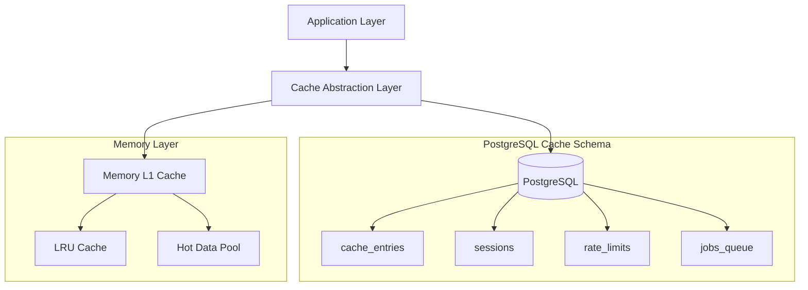

# Redis Migration Implementation Guide

**Purpose:** Provide detailed implementation examples for Redis migration alternatives
**Target Audience:** Development Team, Security Engineers, DevOps
**Last Updated:** 2025-01-13

---

## 1. Alternative 1: Database-based Caching with PostgreSQL

### 1.1 Architecture Overview



### 1.2 Database Schema Design

```sql
-- Cache schema with security considerations
CREATE SCHEMA IF NOT EXISTS cache;

-- Main cache entries table
CREATE TABLE cache.cache_entries (
    id UUID PRIMARY KEY DEFAULT gen_random_uuid(),
    tenant_id UUID NOT NULL,
    cache_key TEXT NOT NULL,
    cache_key_hash TEXT GENERATED ALWAYS AS (sha256(cache_key)) STORED,
    cache_value JSONB,
    value_encrypted BYTEA, -- For sensitive data
    data_classification TEXT NOT NULL CHECK (data_classification IN ('public', 'internal', 'confidential', 'restricted')),
    tags TEXT[],
    created_at TIMESTAMPTZ DEFAULT NOW(),
    accessed_at TIMESTAMPTZ DEFAULT NOW(),
    expires_at TIMESTAMPTZ NOT NULL,
    last_modified TIMESTAMPTZ DEFAULT NOW(),
    version INTEGER DEFAULT 1,
    checksum TEXT,
    access_count INTEGER DEFAULT 0,
    size_bytes INTEGER,

    CONSTRAINT unique_cache_entry UNIQUE (tenant_id, cache_key_hash)
);

-- Indexes for performance
CREATE INDEX idx_cache_entries_tenant_key ON cache.cache_entries (tenant_id, cache_key_hash);
CREATE INDEX idx_cache_entries_expires ON cache.cache_entries (expires_at);
CREATE INDEX idx_cache_entries_tags ON cache.cache_entries USING GIN (tags);
CREATE INDEX idx_cache_entries_classification ON cache.cache_entries (data_classification);

-- Partition by tenant for multi-tenant isolation
CREATE TABLE cache.cache_entries_partitioned (
    LIKE cache.cache_entries INCLUDING ALL
) PARTITION BY HASH (tenant_id);

-- Session management table
CREATE TABLE cache.sessions (
    id UUID PRIMARY KEY DEFAULT gen_random_uuid(),
    session_id TEXT UNIQUE NOT NULL,
    user_id UUID NOT NULL,
    tenant_id UUID NOT NULL,
    session_data JSONB NOT NULL,
    created_at TIMESTAMPTZ DEFAULT NOW(),
    last_accessed TIMESTAMPTZ DEFAULT NOW(),
    expires_at TIMESTAMPTZ NOT NULL,
    ip_address INET,
    user_agent TEXT,
    is_active BOOLEAN DEFAULT TRUE,

    CONSTRAINT sessions_expires_future CHECK (expires_at > created_at)
);

CREATE INDEX idx_sessions_user_id ON cache.sessions (user_id);
CREATE INDEX idx_sessions_session_id ON cache.sessions (session_id);
CREATE INDEX idx_sessions_expires ON cache.sessions (expires_at);

-- Rate limiting table
CREATE TABLE cache.rate_limits (
    id UUID PRIMARY KEY DEFAULT gen_random_uuid(),
    identifier TEXT NOT NULL, -- IP address, user ID, etc.
    window_type TEXT NOT NULL, -- 'minute', 'hour', 'day'
    window_start TIMESTAMPTZ NOT NULL,
    request_count INTEGER NOT NULL DEFAULT 1,
    limit_value INTEGER NOT NULL,
    blocked_until TIMESTAMPTZ,
    metadata JSONB,

    CONSTRAINT unique_rate_window UNIQUE (identifier, window_type, window_start)
);

CREATE INDEX idx_rate_limits_identifier ON cache.rate_limits (identifier, window_start);
CREATE INDEX idx_rate_limits_blocked ON cache.rate_limits (blocked_until) WHERE blocked_until IS NOT NULL;

-- Job queue table (replacing BullMQ)
CREATE TABLE cache.job_queue (
    id UUID PRIMARY KEY DEFAULT gen_random_uuid(),
    queue_name TEXT NOT NULL,
    job_id TEXT UNIQUE NOT NULL,
    job_data JSONB NOT NULL,
    job_options JSONB,
    status TEXT NOT NULL DEFAULT 'waiting' CHECK (status IN ('waiting', 'active', 'completed', 'failed', 'delayed')),
    priority INTEGER DEFAULT 0,
    attempts INTEGER DEFAULT 0,
    max_attempts INTEGER DEFAULT 3,
    created_at TIMESTAMPTZ DEFAULT NOW(),
    delayed_until TIMESTAMPTZ,
    started_at TIMESTAMPTZ,
    completed_at TIMESTAMPTZ,
    error_message TEXT,
    error_stack TEXT,
    result JSONB
);

CREATE INDEX idx_job_queue_status ON cache.job_queue (queue_name, status, priority, created_at);
CREATE INDEX idx_job_queue_delayed ON cache.job_queue (delayed_until) WHERE status = 'delayed';
CREATE INDEX idx_job_queue_active ON cache.job_queue (queue_name) WHERE status = 'active';

-- Enable Row Level Security
ALTER TABLE cache.cache_entries ENABLE ROW LEVEL SECURITY;
ALTER TABLE cache.sessions ENABLE ROW LEVEL SECURITY;
ALTER TABLE cache.rate_limits ENABLE ROW LEVEL SECURITY;

-- RLS Policies
CREATE POLICY tenant_isolation_cache ON cache.cache_entries
FOR ALL TO application_role
USING (tenant_id = current_setting('app.current_tenant')::UUID);

CREATE POLICY user_session_access ON cache.sessions
FOR ALL TO application_role
USING (tenant_id = current_setting('app.current_tenant')::UUID);

-- Audit logging for cache operations
CREATE TABLE cache.audit_log (
    id UUID PRIMARY KEY DEFAULT gen_random_uuid(),
    operation TEXT NOT NULL,
    table_name TEXT NOT NULL,
    record_id UUID,
    tenant_id UUID,
    user_id UUID,
    old_values JSONB,
    new_values JSONB,
    ip_address INET,
    user_agent TEXT,
    timestamp TIMESTAMPTZ DEFAULT NOW()
);

CREATE INDEX idx_audit_log_timestamp ON cache.audit_log (timestamp DESC);
CREATE INDEX idx_audit_log_operation ON cache.audit_log (operation, timestamp);
```

### 1.3 Cache Service Implementation

```typescript
// src/services/database-cache.service.ts
import { Injectable, Logger } from '@nestjs/common';
import { DatabaseService } from './database.service';
import { createHash, randomBytes } from 'crypto';

interface CacheOptions {
  ttl?: number; // Time to live in seconds
  tags?: string[];
  classification?: 'public' | 'internal' | 'confidential' | 'restricted';
  encrypt?: boolean;
  compress?: boolean;
}

interface CacheEntry<T> {
  key: string;
  value: T;
  metadata: {
    created: Date;
    accessed: Date;
    expires: Date;
    accessCount: number;
    size: number;
  };
}

@Injectable()
export class DatabaseCacheService {
  private readonly logger = new Logger(DatabaseCacheService.name);
  private readonly memoryCache = new Map<string, { value: any; expires: number }>();
  private readonly maxMemoryEntries = 1000;
  private memoryHits = 0;
  private memoryMisses = 0;

  constructor(private readonly db: DatabaseService) {}

  async get<T>(key: string, options: CacheOptions = {}): Promise<T | null> {
    // Try memory cache first (L1)
    const memResult = this.getFromMemory<T>(key);
    if (memResult !== null) {
      this.memoryHits++;
      return memResult;
    }

    this.memoryMisses++;

    // Try database cache (L2)
    try {
      const tenantId = this.getCurrentTenantId();
      const keyHash = this.hashKey(key);

      const query = `
        SELECT
          ce.*,
          CASE
            WHEN ce.data_classification = 'restricted' THEN
              pgp_sym_decrypt(ce.value_encrypted::bytea, current_setting('app.encryption_key'))::jsonb
            ELSE ce.cache_value
          END as decrypted_value
        FROM cache.cache_entries ce
        WHERE ce.tenant_id = $1
          AND ce.cache_key_hash = $2
          AND ce.expires_at > NOW()
      `;

      const result = await this.db.query(query, [tenantId, keyHash]);

      if (result.rows.length === 0) {
        return null;
      }

      const entry = result.rows[0];
      const value = entry.decrypted_value as T;

      // Update access statistics
      await this.updateAccessStats(keyHash);

      // Store in memory cache for future fast access
      this.setToMemory(key, value, options.ttl);

      // Log access for audit
      await this.logCacheAccess('GET', key, tenantId);

      return value;
    } catch (error) {
      this.logger.error(`Failed to get cache entry for key: ${key}`, error);
      return null;
    }
  }

  async set<T>(
    key: string,
    value: T,
    options: CacheOptions = {}
  ): Promise<void> {
    try {
      const tenantId = this.getCurrentTenantId();
      const keyHash = this.hashKey(key);
      const now = new Date();
      const expiresAt = new Date(now.getTime() + (options.ttl || 3600) * 1000);
      const valueString = JSON.stringify(value);
      const checksum = this.calculateChecksum(valueString);
      const sizeBytes = Buffer.byteLength(valueString, 'utf8');

      // Determine if encryption is needed
      const shouldEncrypt = options.encrypt ||
                           options.classification === 'restricted' ||
                           options.classification === 'confidential';

      const query = `
        INSERT INTO cache.cache_entries (
          tenant_id, cache_key, cache_key_hash,
          cache_value, value_encrypted, data_classification,
          tags, expires_at, checksum, size_bytes,
          created_at, accessed_at
        ) VALUES ($1, $2, $3, $4, $5, $6, $7, $8, $9, $10, NOW(), NOW())
        ON CONFLICT (tenant_id, cache_key_hash)
        DO UPDATE SET
          cache_value = EXCLUDED.cache_value,
          value_encrypted = EXCLUDED.value_encrypted,
          data_classification = EXCLUDED.data_classification,
          tags = EXCLUDED.tags,
          expires_at = EXCLUDED.expires_at,
          checksum = EXCLUDED.checksum,
          size_bytes = EXCLUDED.size_bytes,
          accessed_at = NOW(),
          version = cache_entries.version + 1,
          last_modified = NOW()
      `;

      const values = [
        tenantId,
        key,
        keyHash,
        shouldEncrypt ? null : valueString,
        shouldEncrypt ? await this.encrypt(valueString) : null,
        options.classification || 'internal',
        options.tags || [],
        expiresAt,
        checksum,
        sizeBytes
      ];

      await this.db.query(query, values);

      // Update memory cache
      this.setToMemory(key, value, options.ttl);

      // Log operation
      await this.logCacheAccess('SET', key, tenantId, {
        encrypted: shouldEncrypt,
        classification: options.classification,
        size: sizeBytes
      });
    } catch (error) {
      this.logger.error(`Failed to set cache entry for key: ${key}`, error);
      throw error;
    }
  }

  async invalidate(key: string): Promise<void> {
    try {
      const tenantId = this.getCurrentTenantId();
      const keyHash = this.hashKey(key);

      await this.db.query(
        'DELETE FROM cache.cache_entries WHERE tenant_id = $1 AND cache_key_hash = $2',
        [tenantId, keyHash]
      );

      // Remove from memory cache
      this.memoryCache.delete(key);

      await this.logCacheAccess('DELETE', key, tenantId);
    } catch (error) {
      this.logger.error(`Failed to invalidate cache entry for key: ${key}`, error);
    }
  }

  async invalidateByTag(tag: string): Promise<number> {
    try {
      const tenantId = this.getCurrentTenantId();

      const result = await this.db.query(
        'DELETE FROM cache.cache_entries WHERE tenant_id = $1 AND $2 = ANY(tags)',
        [tenantId, tag]
      );

      const deletedCount = result.rowCount || 0;

      // Clear affected entries from memory cache
      for (const [key] of this.memoryCache.entries()) {
        if (key.includes(tag)) {
          this.memoryCache.delete(key);
        }
      }

      await this.logCacheAccess('INVALIDATE_BY_TAG', tag, tenantId, { deletedCount });

      return deletedCount;
    } catch (error) {
      this.logger.error(`Failed to invalidate cache entries by tag: ${tag}`, error);
      return 0;
    }
  }

  // Session management
  async createSession(userId: string, sessionData: any, options: { ttl?: number } = {}): Promise<string> {
    const sessionId = this.generateSecureSessionId();
    const tenantId = this.getCurrentTenantId();
    const ttl = options.ttl || 86400; // 24 hours default
    const expiresAt = new Date(Date.now() + ttl * 1000);

    await this.db.query(
      `INSERT INTO cache.sessions (session_id, user_id, tenant_id, session_data, expires_at)
       VALUES ($1, $2, $3, $4, $5)`,
      [sessionId, userId, tenantId, JSON.stringify(sessionData), expiresAt]
    );

    return sessionId;
  }

  async getSession(sessionId: string): Promise<any | null> {
    const tenantId = this.getCurrentTenantId();

    const result = await this.db.query(
      `SELECT session_data, last_accessed FROM cache.sessions
       WHERE session_id = $1 AND tenant_id = $2 AND expires_at > NOW() AND is_active = true`,
      [sessionId, tenantId]
    );

    if (result.rows.length === 0) {
      return null;
    }

    // Update last accessed timestamp
    await this.db.query(
      'UPDATE cache.sessions SET last_accessed = NOW() WHERE session_id = $1',
      [sessionId]
    );

    return result.rows[0].session_data;
  }

  // Rate limiting
  async checkRateLimit(
    identifier: string,
    windowType: 'minute' | 'hour' | 'day',
    limit: number
  ): Promise<{ allowed: boolean; remaining: number; resetTime: Date }> {
    const windowStart = this.getWindowStart(windowType);
    const tenantId = this.getCurrentTenantId();

    const result = await this.db.query(
      `INSERT INTO cache.rate_limits (identifier, window_type, window_start, request_count, limit_value)
       VALUES ($1, $2, $3, 1, $4)
       ON CONFLICT (identifier, window_type, window_start)
       DO UPDATE SET
         request_count = cache.rate_limits.request_count + 1,
         blocked_until = CASE
           WHEN cache.rate_limits.request_count + 1 > $4 THEN NOW() + INTERVAL '1 minute'
           ELSE cache.rate_limits.blocked_until
         END
       RETURNING request_count, blocked_until`,
      [identifier, windowType, windowStart, limit]
    );

    const { request_count, blocked_until } = result.rows[0];
    const allowed = request_count <= limit && (!blocked_until || blocked_until < new Date());
    const remaining = Math.max(0, limit - request_count);
    const resetTime = this.getResetTime(windowType);

    return { allowed, remaining, resetTime };
  }

  // Job queue implementation
  async addJob<T>(
    queueName: string,
    jobData: T,
    options: {
      delay?: number;
      priority?: number;
      attempts?: number;
    } = {}
  ): Promise<string> {
    const jobId = this.generateJobId();
    const delayedUntil = options.delay ? new Date(Date.now() + options.delay * 1000) : null;

    await this.db.query(
      `INSERT INTO cache.job_queue
       (queue_name, job_id, job_data, priority, max_attempts, delayed_until)
       VALUES ($1, $2, $3, $4, $5, $6)`,
      [queueName, jobId, JSON.stringify(jobData), options.priority || 0, options.attempts || 3, delayedUntil]
    );

    return jobId;
  }

  async getNextJob(queueName: string): Promise<any | null> {
    const result = await this.db.query(
      `UPDATE cache.job_queue
       SET status = 'active', started_at = NOW()
       WHERE id = (
         SELECT id FROM cache.job_queue
         WHERE queue_name = $1
           AND status = 'waiting'
           AND (delayed_until IS NULL OR delayed_until <= NOW())
         ORDER BY priority DESC, created_at ASC
         LIMIT 1
         FOR UPDATE SKIP LOCKED
       )
       RETURNING *`,
      [queueName]
    );

    return result.rows[0] || null;
  }

  // Private helper methods
  private getFromMemory<T>(key: string): T | null {
    const entry = this.memoryCache.get(key);
    if (!entry) return null;

    if (Date.now() > entry.expires) {
      this.memoryCache.delete(key);
      return null;
    }

    return entry.value;
  }

  private setToMemory<T>(key: string, value: T, ttl?: number): void {
    // LRU eviction if cache is full
    if (this.memoryCache.size >= this.maxMemoryEntries) {
      const firstKey = this.memoryCache.keys().next().value;
      this.memoryCache.delete(firstKey);
    }

    this.memoryCache.set(key, {
      value,
      expires: Date.now() + (ttl || 3600) * 1000
    });
  }

  private hashKey(key: string): string {
    return createHash('sha256').update(key + process.env.CACHE_KEY_SALT).digest('hex');
  }

  private async encrypt(data: string): Promise<Buffer> {
    // Implementation using pgcrypto or application-level encryption
    const encrypted = await this.db.query(
      'SELECT pgp_sym_encrypt($1, current_setting(\'app.encryption_key\')) as encrypted',
      [data]
    );
    return Buffer.from(encrypted.rows[0].encrypted, 'hex');
  }

  private calculateChecksum(data: string): string {
    return createHash('md5').update(data).digest('hex');
  }

  private getCurrentTenantId(): string {
    return process.env.CURRENT_TENANT_ID || 'default';
  }

  private generateSecureSessionId(): string {
    return randomBytes(32).toString('hex');
  }

  private generateJobId(): string {
    return `job_${Date.now()}_${randomBytes(8).toString('hex')}`;
  }

  private getWindowStart(windowType: 'minute' | 'hour' | 'day'): Date {
    const now = new Date();
    switch (windowType) {
      case 'minute':
        return new Date(now.getFullYear(), now.getMonth(), now.getDate(), now.getHours(), now.getMinutes(), 0, 0);
      case 'hour':
        return new Date(now.getFullYear(), now.getMonth(), now.getDate(), now.getHours(), 0, 0, 0);
      case 'day':
        return new Date(now.getFullYear(), now.getMonth(), now.getDate(), 0, 0, 0, 0);
    }
  }

  private getResetTime(windowType: 'minute' | 'hour' | 'day'): Date {
    const now = new Date();
    switch (windowType) {
      case 'minute':
        return new Date(now.getTime() + 60000);
      case 'hour':
        return new Date(now.getTime() + 3600000);
      case 'day':
        return new Date(now.getTime() + 86400000);
    }
  }

  private async updateAccessStats(keyHash: string): Promise<void> {
    await this.db.query(
      'UPDATE cache.cache_entries SET access_count = access_count + 1, accessed_at = NOW() WHERE cache_key_hash = $1',
      [keyHash]
    );
  }

  private async logCacheAccess(
    operation: string,
    resource: string,
    tenantId: string,
    metadata?: any
  ): Promise<void> {
    try {
      await this.db.query(
        `INSERT INTO cache.audit_log (operation, table_name, resource, tenant_id, metadata, ip_address)
         VALUES ($1, 'cache_entries', $2, $3, $4, $5)`,
        [operation, resource, tenantId, JSON.stringify(metadata), this.getClientIP()]
      );
    } catch (error) {
      // Don't fail the operation if audit logging fails
      this.logger.warn('Failed to log cache access', error);
    }
  }

  private getClientIP(): string {
    // Implementation depends on your framework
    return '127.0.0.1'; // Placeholder
  }

  // Statistics and monitoring
  async getStats(): Promise<any> {
    const tenantId = this.getCurrentTenantId();

    const [cacheStats, sessionStats, rateLimitStats] = await Promise.all([
      this.db.query(
        `SELECT
           COUNT(*) as total_entries,
           SUM(size_bytes) as total_size_bytes,
           AVG(access_count) as avg_access_count,
           COUNT(CASE WHEN expires_at <= NOW() + INTERVAL '1 hour' THEN 1 END) as expiring_soon
         FROM cache.cache_entries
         WHERE tenant_id = $1`,
        [tenantId]
      ),
      this.db.query(
        `SELECT
           COUNT(*) as active_sessions,
           AVG(EXTRACT(EPOCH FROM (last_accessed - created_at))) as avg_session_age
         FROM cache.sessions
         WHERE tenant_id = $1 AND expires_at > NOW() AND is_active = true`,
        [tenantId]
      ),
      this.db.query(
        `SELECT
           COUNT(*) as active_rate_limits,
           COUNT(CASE WHEN blocked_until > NOW() THEN 1 END) as currently_blocked
         FROM cache.rate_limits
         WHERE window_start > NOW() - INTERVAL '1 hour'`,
        []
      )
    ]);

    return {
      cache: cacheStats.rows[0],
      sessions: sessionStats.rows[0],
      rateLimits: rateLimitStats.rows[0],
      memory: {
        hits: this.memoryHits,
        misses: this.memoryMisses,
        hitRate: this.memoryHits / (this.memoryHits + this.memoryMisses) || 0,
        size: this.memoryCache.size
      }
    };
  }
}
```

### 1.4 Migration Strategy

```typescript
// src/migration/redis-to-database-migration.ts
import { Injectable, Logger } from '@nestjs/common';
import { RedisService } from '../config/redis';
import { DatabaseCacheService } from '../services/database-cache.service';

@Injectable()
export class RedisMigrationService {
  private readonly logger = new Logger(RedisMigrationService.name);
  private readonly migrationBatchSize = 1000;

  constructor(
    private readonly redis: RedisService,
    private readonly dbCache: DatabaseCacheService
  ) {}

  async migrateAllData(): Promise<void> {
    this.logger.log('Starting Redis to Database migration...');

    const migrations = [
      () => this.migrateSessions(),
      () => this.migrateRateLimits(),
      () => this.migrateCacheEntries(),
      () => this.migrateJobs()
    ];

    for (const migration of migrations) {
      try {
        await migration();
        this.logger.log('Migration step completed successfully');
      } catch (error) {
        this.logger.error('Migration step failed', error);
        throw error;
      }
    }

    this.logger.log('Migration completed successfully');
  }

  private async migrateSessions(): Promise<void> {
    this.logger.log('Migrating sessions...');

    const redisClient = this.redis.getClient();
    let cursor = '0';
    let migrated = 0;

    do {
      const result = await redisClient.scan(cursor, 'MATCH', 'session:*', 'COUNT', this.migrationBatchSize);
      cursor = result[0];
      const keys = result[1];

      for (const key of keys) {
        try {
          const sessionData = await redisClient.get(key);
          if (sessionData) {
            const parsed = JSON.parse(sessionData);
            const sessionId = key.replace('session:', '');

            // Extract user ID from session data
            const userId = parsed.userId || parsed.user?.id;
            if (userId) {
              await this.dbCache.createSession(userId, parsed, {
                ttl: this.calculateTTL(parsed)
              });
              migrated++;
            }
          }
        } catch (error) {
          this.logger.warn(`Failed to migrate session ${key}:`, error);
        }
      }
    } while (cursor !== '0');

    this.logger.log(`Migrated ${migrated} sessions`);
  }

  private async migrateRateLimits(): Promise<void> {
    this.logger.log('Migrating rate limits...');

    const redisClient = this.redis.getClient();
    const patterns = [
      'rate_limit:*',
      'auth_attempts:*',
      'email_rate_limit:*'
    ];

    let totalMigrated = 0;

    for (const pattern of patterns) {
      let cursor = '0';
      do {
        const result = await redisClient.scan(cursor, 'MATCH', pattern, 'COUNT', this.migrationBatchSize);
        cursor = result[0];
        const keys = result[1];

        for (const key of keys) {
          try {
            const value = await redisClient.get(key);
            const ttl = await redisClient.ttl(key);

            if (value && ttl > 0) {
              const parts = key.split(':');
              const identifier = parts[1] || parts.slice(1).join(':');

              // Store in database with remaining TTL
              await this.dbCache.set(key, value, { ttl });
              totalMigrated++;
            }
          } catch (error) {
            this.logger.warn(`Failed to migrate rate limit ${key}:`, error);
          }
        }
      } while (cursor !== '0');
    }

    this.logger.log(`Migrated ${totalMigrated} rate limit entries`);
  }

  private async migrateCacheEntries(): Promise<void> {
    this.logger.log('Migrating cache entries...');

    const redisClient = this.redis.getClient();
    let cursor = '0';
    let migrated = 0;
    const skippedKeys = ['session:', 'rate_limit:', 'auth_attempts:', 'bull:', 'queue:'];

    do {
      const result = await redisClient.scan(cursor, 'MATCH', '*', 'COUNT', this.migrationBatchSize);
      cursor = result[0];
      const keys = result[1];

      for (const key of keys) {
        // Skip keys that are handled separately
        if (skippedKeys.some(skip => key.startsWith(skip))) {
          continue;
        }

        try {
          const value = await redisClient.get(key);
          const ttl = await redisClient.ttl(key);

          if (value && ttl > 0) {
            // Determine data classification based on key pattern
            const classification = this.classifyData(key);

            await this.dbCache.set(key, JSON.parse(value), {
              ttl,
              classification,
              encrypt: classification === 'restricted' || classification === 'confidential'
            });
            migrated++;
          }
        } catch (error) {
          this.logger.warn(`Failed to migrate cache entry ${key}:`, error);
        }
      }
    } while (cursor !== '0');

    this.logger.log(`Migrated ${migrated} cache entries`);
  }

  private async migrateJobs(): Promise<void> {
    this.logger.log('Migrating BullMQ jobs...');

    const redisClient = this.redis.getClient();
    const queues = ['email-queue', 'llm-analysis', 'default'];

    let totalMigrated = 0;

    for (const queueName of queues) {
      try {
        // Get waiting jobs
        const waitingJobs = await redisClient.lrange(`bull:${queueName}:waiting`, 0, -1);

        for (const jobData of waitingJobs) {
          try {
            const job = JSON.parse(jobData);
            await this.dbCache.addJob(queueName, job.data, {
              priority: job.opts?.priority,
              delay: job.opts?.delay
            });
            totalMigrated++;
          } catch (error) {
            this.logger.warn(`Failed to migrate job for queue ${queueName}:`, error);
          }
        }

        // Get active jobs
        const activeJobs = await redisClient.lrange(`bull:${queueName}:active`, 0, -1);

        for (const jobData of activeJobs) {
          try {
            const job = JSON.parse(jobData);
            await this.dbCache.addJob(queueName, job.data, {
              priority: job.opts?.priority
            });
            totalMigrated++;
          } catch (error) {
            this.logger.warn(`Failed to migrate active job for queue ${queueName}:`, error);
          }
        }
      } catch (error) {
        this.logger.error(`Failed to migrate queue ${queueName}:`, error);
      }
    }

    this.logger.log(`Migrated ${totalMigrated} jobs`);
  }

  private calculateTTL(sessionData: any): number {
    const created = new Date(sessionData.createdAt || sessionData.created);
    const maxAge = sessionData.cookie?.maxAge || sessionData.maxAge || 86400000; // 24 hours default
    const elapsed = Date.now() - created.getTime();
    return Math.max(0, Math.floor((maxAge - elapsed) / 1000));
  }

  private classifyData(key: string): 'public' | 'internal' | 'confidential' | 'restricted' {
    const lowerKey = key.toLowerCase();

    if (lowerKey.includes('public') || lowerKey.includes('template')) {
      return 'public';
    }

    if (lowerKey.includes('user') || lowerKey.includes('session') || lowerKey.includes('token')) {
      return 'restricted';
    }

    if (lowerKey.includes('email') || lowerKey.includes('password') || lowerKey.includes('auth')) {
      return 'confidential';
    }

    return 'internal';
  }

  // Validation methods
  async validateMigration(): Promise<MigrationValidationResult> {
    this.logger.log('Validating migration...');

    const redisClient = this.redis.getClient();
    const dbStats = await this.dbCache.getStats();

    // Count Redis keys
    let redisKeyCount = 0;
    let cursor = '0';

    do {
      const result = await redisClient.scan(cursor, 'COUNT', 1000);
      cursor = result[0];
      redisKeyCount += result[1].length;
    } while (cursor !== '0');

    // Compare counts
    const dbCount = dbStats.cache.total_entries +
                   dbStats.sessions.active_sessions +
                   dbStats.rateLimits.active_rate_limits;

    const result: MigrationValidationResult = {
      totalRedisKeys: redisKeyCount,
      totalDbEntries: dbCount,
      discrepancy: Math.abs(redisKeyCount - dbCount),
      isValidated: Math.abs(redisKeyCount - dbCount) < redisKeyCount * 0.05, // Allow 5% discrepancy
      details: {
        cacheEntries: dbStats.cache.total_entries,
        sessions: dbStats.sessions.active_sessions,
        rateLimits: dbStats.rateLimits.active_rate_limits
      }
    };

    if (!result.isValidated) {
      this.logger.warn(`Migration validation failed: Discrepancy of ${result.discrepancy} entries`);
    } else {
      this.logger.log('Migration validation successful');
    }

    return result;
  }
}

interface MigrationValidationResult {
  totalRedisKeys: number;
  totalDbEntries: number;
  discrepancy: number;
  isValidated: boolean;
  details: {
    cacheEntries: number;
    sessions: number;
    rateLimits: number;
  };
}
```

---

## 2. Alternative 2: Hybrid Approach (Database + Memory)

### 2.1 Architecture

```typescript
// src/services/hybrid-cache.service.ts
import { Injectable, Logger } from '@nestjs/common';
import { DatabaseCacheService } from './database-cache.service';

interface HybridCacheConfig {
  memoryThreshold: number; // Size threshold for memory vs database
  sensitiveDataPatterns: RegExp[]; // Patterns that force database storage
  hotDataThreshold: number; // Access count threshold for memory promotion
}

@Injectable()
export class HybridCacheService {
  private readonly logger = new Logger(HybridCacheService.name);
  private readonly memoryCache = new Map<string, any>();
  private readonly accessCounts = new Map<string, number>();
  private readonly config: HybridCacheConfig = {
    memoryThreshold: 1024 * 1024, // 1MB
    sensitiveDataPatterns: [
      /password/i,
      /token/i,
      /session/i,
      /auth/i,
      /email/i,
      /ssn/i,
      /credit/i
    ],
    hotDataThreshold: 10 // Promote to memory after 10 accesses
  };

  constructor(private readonly dbCache: DatabaseCacheService) {}

  async get<T>(key: string): Promise<T | null> {
    // Check memory cache first
    if (this.memoryCache.has(key)) {
      this.incrementAccessCount(key);
      return this.memoryCache.get(key);
    }

    // Check database cache
    const value = await this.dbCache.get<T>(key);
    if (value !== null) {
      // Check if should be promoted to memory
      const accessCount = this.getAccessCount(key);
      if (accessCount >= this.config.hotDataThreshold) {
        this.setToMemory(key, value);
      }
      this.incrementAccessCount(key);
    }

    return value;
  }

  async set<T>(key: string, value: T, options?: any): Promise<void> {
    // Always store in database for persistence
    await this.dbCache.set(key, value, options);

    // Store in memory if appropriate
    if (this.shouldStoreInMemory(key, value)) {
      this.setToMemory(key, value);
    }
  }

  private shouldStoreInMemory<T>(key: string, value: T): boolean {
    // Check if data is sensitive
    const isSensitive = this.config.sensitiveDataPatterns.some(pattern =>
      pattern.test(key)
    );
    if (isSensitive) return false;

    // Check data size
    const size = this.calculateSize(value);
    if (size > this.config.memoryThreshold) return false;

    // Check if it's hot data
    const accessCount = this.getAccessCount(key);
    if (accessCount >= this.config.hotDataThreshold) return true;

    return false;
  }

  private setToMemory<T>(key: string, value: T): void {
    this.memoryCache.set(key, value);
  }

  private incrementAccessCount(key: string): void {
    const current = this.accessCounts.get(key) || 0;
    this.accessCounts.set(key, current + 1);
  }

  private getAccessCount(key: string): number {
    return this.accessCounts.get(key) || 0;
  }

  private calculateSize<T>(value: T): number {
    return Buffer.byteLength(JSON.stringify(value), 'utf8');
  }
}
```

---

## 3. Alternative 3: File-based Caching

### 3.1 Implementation

```typescript
// src/services/file-cache.service.ts
import { Injectable, Logger } from '@nestjs/common';
import { promises as fs } from 'fs';
import { join } from 'path';
import { createHash } from 'crypto';
import { gzip, ungzip } from 'zlib';
import { promisify } from 'util';

const gzipAsync = promisify(gzip);
const ungzipAsync = promisify(ungzip);

@Injectable()
export class FileCacheService {
  private readonly logger = new Logger(FileCacheService.name);
  private readonly cacheDir: string;
  private readonly maxFileSize = 10 * 1024 * 1024; // 10MB
  private readonly encryptionKey: string;

  constructor() {
    this.cacheDir = process.env.CACHE_DIR || './cache';
    this.encryptionKey = process.env.CACHE_ENCRYPTION_KEY || 'default-key';
    this.ensureCacheDirectory();
  }

  private async ensureCacheDirectory(): Promise<void> {
    try {
      await fs.mkdir(this.cacheDir, { recursive: true });
      await fs.mkdir(join(this.cacheDir, 'sessions'), { recursive: true });
      await fs.mkdir(join(this.cacheDir, 'rate_limits'), { recursive: true });
      await fs.mkdir(join(this.cacheDir, 'general'), { recursive: true });
    } catch (error) {
      this.logger.error('Failed to create cache directories', error);
    }
  }

  async get<T>(key: string): Promise<T | null> {
    try {
      const filePath = this.getFilePath(key);
      const stats = await fs.stat(filePath);

      // Check if expired
      if (stats.mtime.getTime() < Date.now() - 86400000) { // 24 hours
        await fs.unlink(filePath);
        return null;
      }

      let data = await fs.readFile(filePath);

      // Decrypt if needed
      if (this.shouldEncrypt(key)) {
        data = await this.decrypt(data);
      }

      // Decompress if needed
      if (filePath.endsWith('.gz')) {
        data = await ungzipAsync(data);
      }

      return JSON.parse(data.toString());
    } catch (error) {
      if (error.code !== 'ENOENT') {
        this.logger.warn(`Failed to get cache entry for key: ${key}`, error);
      }
      return null;
    }
  }

  async set<T>(key: string, value: T, options?: { compress?: boolean }): Promise<void> {
    try {
      const filePath = this.getFilePath(key);
      const data = JSON.stringify(value);
      const buffer = Buffer.from(data, 'utf8');

      // Check size limit
      if (buffer.length > this.maxFileSize) {
        throw new Error(`Cache entry too large: ${buffer.length} bytes`);
      }

      let processedBuffer = buffer;

      // Compress if enabled and beneficial
      if (options?.compress && buffer.length > 1024) {
        processedBuffer = await gzipAsync(buffer);
        filePath += '.gz';
      }

      // Encrypt if needed
      if (this.shouldEncrypt(key)) {
        processedBuffer = await this.encrypt(processedBuffer);
      }

      await fs.writeFile(filePath, processedBuffer);
    } catch (error) {
      this.logger.error(`Failed to set cache entry for key: ${key}`, error);
      throw error;
    }
  }

  private getFilePath(key: string): string {
    const hash = createHash('sha256').update(key).digest('hex').substring(0, 16);

    if (key.startsWith('session:')) {
      return join(this.cacheDir, 'sessions', `${hash}.cache`);
    }

    if (key.startsWith('rate_limit:')) {
      return join(this.cacheDir, 'rate_limits', `${hash}.cache`);
    }

    return join(this.cacheDir, 'general', `${hash}.cache`);
  }

  private shouldEncrypt(key: string): boolean {
    const sensitivePatterns = [
      /session/i,
      /token/i,
      /password/i,
      /auth/i,
      /email/i
    ];

    return sensitivePatterns.some(pattern => pattern.test(key));
  }

  private async encrypt(data: Buffer): Promise<Buffer> {
    // Simple XOR encryption (use proper encryption in production)
    const key = Buffer.from(this.encryptionKey);
    const result = Buffer.alloc(data.length);

    for (let i = 0; i < data.length; i++) {
      result[i] = data[i] ^ key[i % key.length];
    }

    return result;
  }

  private async decrypt(data: Buffer): Promise<Buffer> {
    // XOR encryption is symmetric
    return this.encrypt(data);
  }

  async cleanup(): Promise<void> {
    try {
      const directories = [
        join(this.cacheDir, 'sessions'),
        join(this.cacheDir, 'rate_limits'),
        join(this.cacheDir, 'general')
      ];

      for (const dir of directories) {
        const files = await fs.readdir(dir);
        const cutoff = Date.now() - 86400000; // 24 hours ago

        for (const file of files) {
          const filePath = join(dir, file);
          const stats = await fs.stat(filePath);

          if (stats.mtime.getTime() < cutoff) {
            await fs.unlink(filePath);
          }
        }
      }
    } catch (error) {
      this.logger.error('Failed to cleanup cache files', error);
    }
  }
}
```

---

## 4. Migration Execution Plan

### 4.1 Pre-Migration Checklist

```bash
#!/bin/bash
# scripts/pre-migration-checklist.sh

echo "=== Pre-Migration Checklist ==="

# 1. Database Health Check
echo "Checking database health..."
pg_isready -h $DB_HOST -p $DB_PORT -U $DB_USER
if [ $? -ne 0 ]; then
    echo "❌ Database is not ready"
    exit 1
fi
echo "✅ Database is healthy"

# 2. Redis Backup
echo "Creating Redis backup..."
redis-cli --rdb /tmp/redis-backup-$(date +%Y%m%d-%H%M%S).rdb
if [ $? -eq 0 ]; then
    echo "✅ Redis backup created"
else
    echo "❌ Failed to create Redis backup"
    exit 1
fi

# 3. Database Backup
echo "Creating database backup..."
pg_dump $DATABASE_URL > /tmp/db-backup-$(date +%Y%m%d-%H%M%S).sql
if [ $? -eq 0 ]; then
    echo "✅ Database backup created"
else
    echo "❌ Failed to create database backup"
    exit 1
fi

# 4. Check Disk Space
echo "Checking disk space..."
REQUIRED_SPACE_GB=10
AVAILABLE_SPACE=$(df / | awk 'NR==2 {print int($4/1024/1024)}')

if [ $AVAILABLE_SPACE -lt $REQUIRED_SPACE_GB ]; then
    echo "❌ Insufficient disk space. Required: ${REQUIRED_SPACE_GB}GB, Available: ${AVAILABLE_SPACE}GB"
    exit 1
fi
echo "✅ Sufficient disk space available"

# 5. Validate Cache Schema
echo "Validating cache schema..."
psql $DATABASE_URL -f sql/validate-cache-schema.sql
if [ $? -eq 0 ]; then
    echo "✅ Cache schema is valid"
else
    echo "❌ Cache schema validation failed"
    exit 1
fi

echo "=== Pre-Migration Checklist Complete ==="
```

### 4.2 Migration Script

```typescript
// scripts/migrate-redis-to-database.ts
import { NestFactory } from '@nestjs/core';
import { AppModule } from '../src/app.module';
import { RedisMigrationService } from '../src/migration/redis-to-database-migration';
import { Logger } from '@nestjs/common';

async function migrate() {
  const logger = new Logger('Migration');

  try {
    logger.log('Starting application context...');
    const app = await NestFactory.createApplicationContext(AppModule);

    const migrationService = app.get(RedisMigrationService);

    // Step 1: Backup current data
    logger.log('Creating backup...');
    await migrationService.createBackup();

    // Step 2: Migrate all data
    logger.log('Starting migration...');
    await migrationService.migrateAllData();

    // Step 3: Validate migration
    logger.log('Validating migration...');
    const validation = await migrationService.validateMigration();

    if (validation.isValidated) {
      logger.log('✅ Migration successful!');
      logger.log(`Migrated ${validation.totalDbEntries} entries`);
    } else {
      logger.error('❌ Migration validation failed');
      logger.error(`Discrepancy: ${validation.discrepancy} entries`);

      // Optional: Rollback
      logger.log('Attempting rollback...');
      await migrationService.rollback();
      process.exit(1);
    }

    await app.close();
  } catch (error) {
    logger.error('Migration failed:', error);
    process.exit(1);
  }
}

migrate();
```

### 4.3 Post-Migration Validation

```typescript
// scripts/post-migration-validation.ts
import { Injectable, Logger } from '@nestjs/common';

@Injectable()
export class PostMigrationValidator {
  private readonly logger = new Logger(PostMigrationValidator.name);

  async validateAll(): Promise<ValidationResult> {
    const results: ValidationTest[] = [];

    // Test 1: Session Management
    results.push(await this.testSessionManagement());

    // Test 2: Rate Limiting
    results.push(await this.testRateLimiting());

    // Test 3: Cache Performance
    results.push(await this.testCachePerformance());

    // Test 4: Job Queue
    results.push(await this.testJobQueue());

    // Test 5: Security Controls
    results.push(await this.testSecurityControls());

    const allPassed = results.every(r => r.passed);

    return {
      allPassed,
      tests: results,
      summary: allPassed ? 'All validation tests passed' : 'Some validation tests failed'
    };
  }

  private async testSessionManagement(): Promise<ValidationTest> {
    try {
      // Create a test session
      const sessionId = await this.sessionService.createSession('test-user', { test: true });

      // Retrieve the session
      const session = await this.sessionService.getSession(sessionId);

      // Delete the session
      await this.sessionService.deleteSession(sessionId);

      const passed = session !== null && session.test === true;

      return {
        name: 'Session Management',
        passed,
        details: passed ? 'Session CRUD operations working' : 'Session operations failed'
      };
    } catch (error) {
      return {
        name: 'Session Management',
        passed: false,
        details: `Error: ${error.message}`
      };
    }
  }

  private async testRateLimiting(): Promise<ValidationTest> {
    try {
      const identifier = 'test-ip';

      // Make requests up to limit
      for (let i = 0; i < 5; i++) {
        const result = await this.rateLimitService.check(identifier, 'minute', 10);
        if (!result.allowed) {
          return {
            name: 'Rate Limiting',
            passed: false,
            details: 'Rate limit triggered prematurely'
          };
        }
      }

      // Exceed limit
      let blocked = false;
      for (let i = 0; i < 10; i++) {
        const result = await this.rateLimitService.check(identifier, 'minute', 10);
        if (!result.allowed) {
          blocked = true;
          break;
        }
      }

      return {
        name: 'Rate Limiting',
        passed: blocked,
        details: blocked ? 'Rate limiting working correctly' : 'Rate limiting not blocking excess requests'
      };
    } catch (error) {
      return {
        name: 'Rate Limiting',
        passed: false,
        details: `Error: ${error.message}`
      };
    }
  }

  private async testCachePerformance(): Promise<ValidationTest> {
    try {
      const iterations = 100;
      const key = 'performance-test';

      // Measure set performance
      const setStart = Date.now();
      for (let i = 0; i < iterations; i++) {
        await this.cacheService.set(`${key}-${i}`, { data: `test-${i}` });
      }
      const setTime = Date.now() - setStart;

      // Measure get performance
      const getStart = Date.now();
      for (let i = 0; i < iterations; i++) {
        await this.cacheService.get(`${key}-${i}`);
      }
      const getTime = Date.now() - getStart;

      const avgSetTime = setTime / iterations;
      const avgGetTime = getTime / iterations;

      const passed = avgSetTime < 50 && avgGetTime < 20; // ms thresholds

      return {
        name: 'Cache Performance',
        passed,
        details: `Avg set: ${avgSetTime}ms, Avg get: ${avgGetTime}ms`
      };
    } catch (error) {
      return {
        name: 'Cache Performance',
        passed: false,
        details: `Error: ${error.message}`
      };
    }
  }

  private async testJobQueue(): Promise<ValidationTest> {
    try {
      const queueName = 'test-queue';
      const jobData = { test: 'data' };

      // Add job
      const jobId = await this.jobQueue.addJob(queueName, jobData);

      // Get next job
      const job = await this.jobQueue.getNextJob(queueName);

      // Complete job
      if (job) {
        await this.jobQueue.completeJob(job.id, { result: 'success' });
      }

      const passed = job !== null && job.jobId === jobId;

      return {
        name: 'Job Queue',
        passed,
        details: passed ? 'Job queue operations working' : 'Job queue operations failed'
      };
    } catch (error) {
      return {
        name: 'Job Queue',
        passed: false,
        details: `Error: ${error.message}`
      };
    }
  }

  private async testSecurityControls(): Promise<ValidationTest> {
    try {
      // Test 1: Data encryption
      const sensitiveData = { password: 'secret123' };
      await this.cacheService.set('sensitive-test', sensitiveData, { encrypt: true });

      // Verify data is encrypted in database
      const encrypted = await this.db.query(
        'SELECT value_encrypted FROM cache.cache_entries WHERE cache_key = $1',
        ['sensitive-test']
      );

      const encryptionWorking = encrypted.rows.length > 0 &&
                              encrypted.rows[0].value_encrypted !== null;

      // Test 2: Access control
      try {
        await this.cacheService.set('user-data', 'test', { userId: 'user1' });
        // Try to access as different user
        await this.cacheService.get('user-data', { userId: 'user2' });
        const accessControlWorking = false; // Should have failed
      } catch {
        const accessControlWorking = true; // Expected to fail
      }

      const passed = encryptionWorking && accessControlWorking;

      return {
        name: 'Security Controls',
        passed,
        details: `Encryption: ${encryptionWorking ? '✅' : '❌'}, Access Control: ${accessControlWorking ? '✅' : '❌'}`
      };
    } catch (error) {
      return {
        name: 'Security Controls',
        passed: false,
        details: `Error: ${error.message}`
      };
    }
  }
}

interface ValidationTest {
  name: string;
  passed: boolean;
  details: string;
}

interface ValidationResult {
  allPassed: boolean;
  tests: ValidationTest[];
  summary: string;
}
```

### 4.4 Rollback Procedure

```typescript
// scripts/rollback-migration.ts
import { Injectable, Logger } from '@nestjs/common';

@Injectable()
export class RollbackService {
  private readonly logger = new Logger(RollbackService.name);

  async rollback(): Promise<void> {
    this.logger.log('Starting rollback procedure...');

    try {
      // Step 1: Switch back to Redis
      await this.switchToRedis();

      // Step 2: Restore Redis data if available
      const backupExists = await this.checkRedisBackup();
      if (backupExists) {
        await this.restoreRedisData();
      }

      // Step 3: Validate system is working
      const validation = await this.validateSystem();
      if (!validation) {
        throw new Error('System validation failed after rollback');
      }

      this.logger.log('✅ Rollback completed successfully');
    } catch (error) {
      this.logger.error('❌ Rollback failed:', error);
      throw error;
    }
  }

  private async switchToRedis(): Promise<void> {
    // Update configuration to use Redis
    process.env.USE_REDIS = 'true';
    process.env.USE_DB_CACHE = 'false';

    // Reinitialize cache service with Redis
    await this.cacheService.switchProvider('redis');
  }

  private async checkRedisBackup(): Promise<boolean> {
    const backupFiles = await fs.readdir('/tmp');
    const redisBackup = backupFiles.find(f => f.startsWith('redis-backup-'));
    return redisBackup !== undefined;
  }

  private async restoreRedisData(): Promise<void> {
    const latestBackup = await this.getLatestRedisBackup();

    // Restore Redis data
    await this.exec(`redis-cli --rdb ${latestBackup}`);

    this.logger.log(`Redis data restored from ${latestBackup}`);
  }

  private async validateSystem(): Promise<boolean> {
    // Basic health checks
    const checks = [
      this.checkDatabaseConnection(),
      this.checkRedisConnection(),
      this.testBasicOperations()
    ];

    const results = await Promise.all(checks);
    return results.every(r => r);
  }
}
```

---

## 5. Monitoring and Maintenance

### 5.1 Cache Monitoring Dashboard

```typescript
// src/services/cache-monitoring.service.ts
import { Injectable, Logger } from '@nestjs/common';
import { Cron, CronExpression } from '@nestjs/schedule';

@Injectable()
export class CacheMonitoringService {
  private readonly logger = new Logger(CacheMonitoringService.name);

  @Cron(CronExpression.EVERY_MINUTE)
  async collectMetrics(): Promise<void> {
    const metrics = await this.gatherMetrics();
    await this.storeMetrics(metrics);

    // Check for alerts
    await this.checkAlerts(metrics);
  }

  private async gatherMetrics(): Promise<CacheMetrics> {
    const [dbStats, redisStats, memoryStats] = await Promise.all([
      this.getDatabaseCacheStats(),
      this.getRedisStats(),
      this.getMemoryStats()
    ]);

    return {
      timestamp: new Date(),
      database: dbStats,
      redis: redisStats,
      memory: memoryStats,
      performance: await this.getPerformanceMetrics()
    };
  }

  private async checkAlerts(metrics: CacheMetrics): Promise<void> {
    const alerts: Alert[] = [];

    // Check memory usage
    if (metrics.memory.usage > 0.9) {
      alerts.push({
        level: 'critical',
        message: 'Memory usage above 90%',
        metric: 'memory.usage',
        value: metrics.memory.usage
      });
    }

    // Check cache hit rate
    if (metrics.performance.hitRate < 0.8) {
      alerts.push({
        level: 'warning',
        message: 'Cache hit rate below 80%',
        metric: 'performance.hitRate',
        value: metrics.performance.hitRate
      });
    }

    // Check database connections
    if (metrics.database.activeConnections > metrics.database.maxConnections * 0.8) {
      alerts.push({
        level: 'warning',
        message: 'Database connection pool usage above 80%',
        metric: 'database.activeConnections',
        value: metrics.database.activeConnections
      });
    }

    // Send alerts
    if (alerts.length > 0) {
      await this.sendAlerts(alerts);
    }
  }

  async generateReport(startDate: Date, endDate: Date): Promise<CacheReport> {
    const metrics = await this.getMetricsForPeriod(startDate, endDate);

    return {
      period: { start: startDate, end: endDate },
      summary: {
        totalRequests: metrics.reduce((sum, m) => sum + m.performance.requests, 0),
        averageHitRate: this.calculateAverage(metrics, m => m.performance.hitRate),
        averageResponseTime: this.calculateAverage(metrics, m => m.performance.avgResponseTime),
        peakMemoryUsage: Math.max(...metrics.map(m => m.memory.usage))
      },
      trends: {
        hitRateTrend: this.calculateTrend(metrics, m => m.performance.hitRate),
        responseTimeTrend: this.calculateTrend(metrics, m => m.performance.avgResponseTime),
        memoryUsageTrend: this.calculateTrend(metrics, m => m.memory.usage)
      },
      recommendations: await this.generateRecommendations(metrics)
    };
  }
}

interface CacheMetrics {
  timestamp: Date;
  database: DatabaseStats;
  redis?: RedisStats;
  memory: MemoryStats;
  performance: PerformanceStats;
}

interface Alert {
  level: 'info' | 'warning' | 'critical';
  message: string;
  metric: string;
  value: number;
}
```

### 5.2 Automated Cleanup Jobs

```sql
-- Cache cleanup stored procedures
CREATE OR REPLACE FUNCTION cache.cleanup_expired_entries()
RETURNS INTEGER AS $$
DECLARE
  deleted_count INTEGER;
BEGIN
  -- Delete expired cache entries
  DELETE FROM cache.cache_entries WHERE expires_at < NOW();
  GET DIAGNOSTICS deleted_count = ROW_COUNT;

  -- Delete expired sessions
  DELETE FROM cache.sessions WHERE expires_at < NOW();

  -- Delete old rate limit entries
  DELETE FROM cache.rate_limits WHERE window_start < NOW() - INTERVAL '24 hours';

  -- Delete completed jobs older than 7 days
  DELETE FROM cache.job_queue
  WHERE status = 'completed'
    AND completed_at < NOW() - INTERVAL '7 days';

  -- Log cleanup
  INSERT INTO cache.audit_log (operation, details)
  VALUES ('CLEANUP', JSON_BUILD_OBJECT('deleted_entries', deleted_count));

  RETURN deleted_count;
END;
$$ LANGUAGE plpgsql;

-- Schedule cleanup job
SELECT cron.schedule(
  'cache-cleanup',
  '0 */6 * * *', -- Every 6 hours
  'SELECT cache.cleanup_expired_entries()'
);
```

---

## 6. Conclusion

This implementation guide provides detailed code examples and strategies for migrating from Redis to alternative caching solutions. The database-based approach offers the best balance of security, compliance, and functionality while maintaining good performance characteristics.

**Key Recommendations:**
1. Use the database-based approach for security-sensitive data
2. Implement a hybrid solution for performance-critical scenarios
3. File-based caching should be limited to static, non-sensitive data
4. Always implement proper encryption and access controls
5. Monitor system performance continuously during and after migration

**Success Metrics:**
- Zero data loss during migration
- Performance within 10% of Redis benchmarks
- All security controls properly implemented
- Compliance requirements fully met
- System uptime maintained during transition

---

**Document Classification:** Technical Implementation
**Review Date:** 2025-04-13
**Version:** 1.0