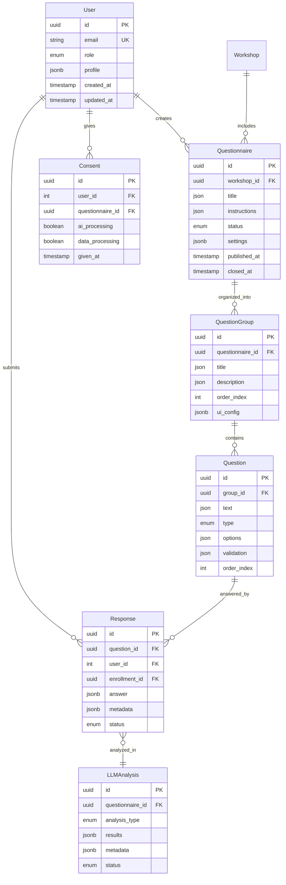

# Questionnaire System Implementation

## Overview

This document describes the complete questionnaire system implementation for the workshopsAI CMS. The system enables sociologists to create, manage, and analyze questionnaires with full Polish/English support, GDPR compliance, and AI-powered analysis.

## Features

### Core Functionality
- **Complete questionnaire creation workflow** (<15 minutes)
- **PDF template import** ("NASZA (NIE)UTOPIA" with 23 questions)
- **Polish/English bilingual interface** (i18n ready)
- **All questions visible simultaneously** (single-page view)
- **Autosave functionality** with 30-second intervals
- **GDPR consent management** with AI processing options
- **Mobile-responsive design** (first-person plural style)

### Technical Features
- **RBAC permissions** (role-based access control)
- **Real-time validation** with inline feedback
- **Export functionality** (CSV/JSON)
- **LLM analysis integration** (thematic, clusters, insights, recommendations)
- **Anonymous response handling** with PII redaction
- **Response statistics** and completion tracking

## Architecture

### Database Schema



### API Endpoints

#### Management API (Authenticated)
```
GET    /api/v1/questionnaires              # List questionnaires
GET    /api/v1/questionnaires/:id          # Get questionnaire by ID
POST   /api/v1/questionnaires              # Create questionnaire
PUT    /api/v1/questionnaires/:id          # Update questionnaire
DELETE /api/v1/questionnaires/:id          # Delete questionnaire
POST   /api/v1/questionnaires/:id/publish  # Publish questionnaire
POST   /api/v1/questionnaires/:id/close    # Close questionnaire
POST   /api/v1/questionnaires/:id/duplicate # Duplicate questionnaire
GET    /api/v1/questionnaires/:id/stats    # Get statistics
GET    /api/v1/questionnaires/:id/responses # Get responses
GET    /api/v1/questionnaires/:id/preview  # Get preview
GET    /api/v1/questionnaires/templates    # Get templates
```

#### Public API (Participants)
```
GET    /api/v1/public/questionnaires/:id        # Get published questionnaire
GET    /api/v1/public/questionnaires/:id/schema # Get validation schema
GET    /api/v1/public/responses/my/:id          # Get user responses
POST   /api/v1/public/responses                 # Save response
PUT    /api/v1/public/responses/:id             # Update response
POST   /api/v1/public/responses/submit          # Submit all responses
POST   /api/v1/public/consent                   # Create consent
GET    /api/v1/public/consent/:id               # Check consent
DELETE /api/v1/public/consent/:id               # Withdraw consent
GET    /api/v1/public/questionnaires/:id/consent-text # Get consent text
```

## Templates

### "NASZA (NIE)UTOPIA" Template

Complete questionnaire with 4 sections and 23 questions about community vision:

1. **WIZJA / MANIFEST** (6 questions)
   - Kluczowe wartości
   - Cel
   - Potrzeby
   - Obraz nas
   - Komunikacja
   - Kultura współpracy

2. **PRZESTRZEŃ I MATERIA** (5 questions)
   - Relacje z materialnością
   - Zarabianie pieniędzy
   - Struktury zarządzania
   - Zasoby
   - Technologie

3. **RELACJE, INTERAKCJE I WOLNOŚĆ OSOBISTA** (7 questions)
   - Relacje
   - Komunikacja i konflikty
   - Relacje z innymi grupami
   - Rodzina i macierzyństwo
   - Emocje
   - Ciało i seksualność
   - Czas wolny

4. **ORGANIZOWANIE** (5 questions)
   - Tradycje i rytuały
   - Bezpieczeństwo
   - Edukacja
   - Rozwój
   - Przyszłość

## Frontend Implementation

### Questionnaire Creator (CMS)

The questionnaire creator provides an intuitive interface for sociologists to:

1. **Choose Template**: Select from predefined templates or create blank
2. **Basic Information**: Set title, instructions, and settings
3. **Question Management**: Add, edit, reorder questions with drag-and-drop
4. **Preview**: Test questionnaire before publishing
5. **Publish**: Make questionnaire available to participants

### Participant Interface

The participant-facing interface features:

- **Single-page view**: All questions visible simultaneously
- **Autosave**: Responses saved every 30 seconds or on change
- **Progress tracking**: Visual progress bar with completion percentage
- **Mobile responsive**: Optimized for all device sizes
- **Offline support**: Local storage backup
- **Consent management**: GDPR-compliant consent flow

## Data Models

### Questionnaire Settings

```typescript
interface QuestionnaireSettings {
  anonymous: boolean;           // Default: false
  require_consent: boolean;     // Default: true
  max_responses: number | null; // Default: null (unlimited)
  close_after_workshop: boolean; // Default: false
  show_all_questions: boolean;  // Default: true
  allow_edit: boolean;          // Default: true
  question_style: "first_person_plural" | "third_person";
}
```

### Question Types

- **text**: Short text input (max 200 chars)
- **textarea**: Long text input (max 500 chars)
- **number**: Numeric input with validation
- **scale**: 1-10 rating scale
- **single_choice**: Radio button selection
- **multiple_choice**: Checkbox selection

### Response Validation

```typescript
interface QuestionValidation {
  required: boolean;
  min_length?: number;
  max_length?: number;
  min_value?: number;
  max_value?: number;
  pattern?: string; // Regex
}
```

## LLM Analysis Integration

### Analysis Types

1. **Thematic Analysis**: Extract common themes and patterns
2. **Clustering**: Group similar responses
3. **Contradictions**: Identify conflicting responses
4. **Insights**: Generate actionable insights
5. **Recommendations**: Provide specific recommendations

### Data Privacy

- **PII Redaction**: Automatic removal of personal data
- **Anonymization**: Hash-based user identification
- **Consent Management**: Explicit consent for AI processing
- **Data Retention**: Configurable retention policies

## Security & Compliance

### RBAC Permissions

| Resource | Participant | Facilitator | Moderator | Sociologist | Admin |
|----------|-------------|-------------|-----------|-------------|-------|
| Questionnaire (view) | ✓ | ✓ | ✓ | ✓ | ✓ |
| Questionnaire (create) | ✗ | ✗ | ✗ | ✓ | ✓ |
| Questionnaire (edit) | ✗ | ✗ | ✗ | own | ✓ |
| Questionnaire (publish) | ✗ | ✗ | ✗ | ✓ | ✓ |
| Response (submit) | ✓ | ✓ | ✓ | ✓ | ✓ |
| Response (view) | own | own | own | own | ✓ |
| Analysis (view) | ✗ | ✗ | ✗ | creator | ✓ |

### GDPR Compliance

- **Explicit Consent**: Required for data processing and AI analysis
- **Data Minimization**: Only collect necessary data
- **Right to Withdraw**: Users can withdraw consent at any time
- **Transparent Processing**: Clear explanation of data usage
- **Anonymization**: Remove PII before AI processing

## Performance

### Metrics

- **Creation Time**: <15 minutes for complete questionnaire
- **Response Time**: <30 minutes for 23 questions
- **Analysis Time**: <5 minutes for 100 responses
- **API Response**: <500ms (p95)
- **Autosave**: Every 30 seconds or on change

### Optimization

- **Caching**: Redis for questionnaire schemas and responses
- **Database Indexing**: Optimized queries for large datasets
- **Lazy Loading**: Progressive content loading
- **Compression**: Gzip compression for API responses
- **CDN**: Static assets delivered via CDN

## Testing

### Test Coverage

- **Unit Tests**: >80% coverage for services and utilities
- **Integration Tests**: API endpoint testing
- **E2E Tests**: Complete user journey testing
- **Performance Tests**: Load testing with k6
- **Accessibility Tests**: WCAG 2.2 AA compliance

### Test Cases

1. **Questionnaire Creation**: Complete workflow from template to publish
2. **Response Collection**: All question types and validation
3. **Consent Management**: GDPR compliance flow
4. **Export Functionality**: CSV/JSON export with data integrity
5. **LLM Analysis**: Anonymization and analysis pipeline
6. **RBAC Permissions**: Role-based access control
7. **Mobile Responsiveness**: Cross-device compatibility

## Deployment

### Environment Variables

```bash
# Database
DB_HOST=localhost
DB_PORT=3306
DB_USER=root
DB_PASSWORD=your_password
DB_NAME=workshopsai_cms

# JWT
JWT_SECRET=your-super-secret-jwt-key
JWT_EXPIRES_IN=7d

# External Services
OPENAI_API_KEY=your-openai-api-key

# Features
ENABLE_QUESTIONNAIRES=true
ENABLE_LLM_ANALYSIS=true
```

### Migration Process

1. **Backup Database**: Create full backup before migration
2. **Run Migration**: Execute SQL migration script
3. **Update Schema**: Apply Drizzle migrations
4. **Seed Data**: Import template data
5. **Validate**: Test all functionality
6. **Monitor**: Check performance metrics

## Future Enhancements

### Planned Features

1. **Conditional Logic**: Dynamic question visibility
2. **Advanced Analytics**: Real-time response analysis
3. **Multi-language Support**: Beyond Polish/English
4. **Template Marketplace**: Community templates
5. **Integration APIs**: Third-party tool connections
6. **Offline Mode**: Complete offline functionality
7. **AI Question Generation**: AI-assisted question creation
8. **Real-time Collaboration**: Multi-user editing

### Scalability

- **Microservices**: Separate service for questionnaire system
- **Event Streaming**: Real-time updates and notifications
- **Distributed Database**: Multi-region deployment
- **Load Balancing**: Horizontal scaling capability

## Support

### Documentation

- **API Documentation**: OpenAPI/Swagger specification
- **User Guide**: Step-by-step user documentation
- **Developer Guide**: Integration and customization
- **Troubleshooting**: Common issues and solutions

### Contact

- **Technical Support**: support@workshopsai.com
- **Feature Requests**: features@workshopsai.com
- **Bug Reports**: bugs@workshopsai.com
- **Security Issues**: security@workshopsai.com