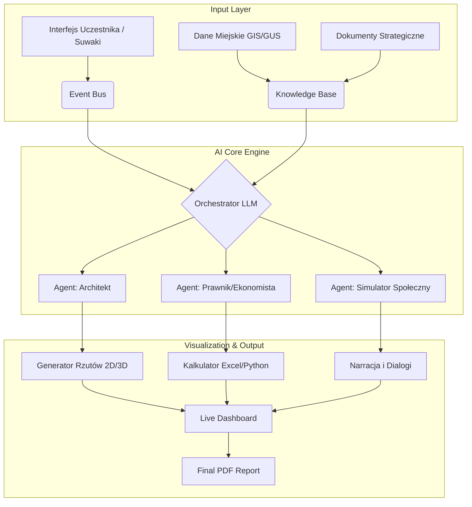

To jest zadanie dla eksperta łączącego GovTech, urbanistykę i Service Design. Poniżej przedstawiam kompleksową analizę i radykalną przebudowę konceptu, aby przekształcić go z „ciekawego eksperymentu” w **strategiczne narzędzie planowania miejskiego klasy enterprise**.

---

# 1. Szybki skrót i diagnoza (Stan Obecny - AS IS)

**Streszczenie konceptu:**

1. **Cel:** Zaprojektowanie modelu co-livingu dla gminy przy wsparciu AI.
2. **Uczestnicy:** ~10 osób (urzędnicy, eksperci).
3. **Czas:** 3-4 godziny.
4. **Core:** Hybrydowa inteligencja (Ludzie + AI) i Rapid Prototyping.
5. **Moduł 1:** Empatia z AI Personami (zrozumienie potrzeb).
6. **Moduł 2:** Konfiguracja "Hardware" (przestrzeń) i "Software" (zasady).
7. **Moduł 3:** Rozwiązywanie konfliktów z AI Mediatorem.
8. **Moduł 4:** Symulacja "Rok z życia" (narracja przyszłości).
9. **Technologia:** CMS z czatem, dashboard facylitatora, generator scenariuszy.
10. **Output:** Narracja sukcesów/kryzysów i prototyp zasad.

**Mocne strony:**

* **Interaktywne Persony:** Świetny sposób na wyjście z bańki urzędniczej i konfrontację z „żywym” obywatelem.
* **Symulacja przyszłości:** Testowanie rozwiązań w czasie (czwarty wymiar), co jest rzadkie w statycznych warsztatach.
* **Conflict-Centric:** Odważne podejście do trudnych tematów zamiast ich pudrowania.

**Główne luki i ryzyka:**

* **Brak osadzenia w twardych realiach:** Warsztat generuje „opowieści”, a samorząd potrzebuje „studiów wykonalności”. Brak weryfikacji budżetowej, prawnej (polskie prawo lokalowe/budowlane) i przestrzennej (działka).
* **Skalowalność:** 10 osób to za mało na proces partycypacyjny. To spotkanie robocze, a nie warsztat konsultacyjny.
* **Abstrakcyjność wyniku:** Narracja o „konflikcie w kuchni” jest ciekawa, ale nie przekłada się bezpośrednio na PFU (Program Funkcjonalno-Użytkowy).
* **Ryzyko „Black Box”:** Uczestnicy mogą czuć, że AI „wymyśla” wyniki losowo, jeśli nie zobaczą logiki stojącej za symulacją.

---

# 2. Research i Benchmarking (Trendy i Implikacje)

Na podstawie analizy trendów Urban Tech, GovTech i Co-livingu w Polsce i UE:

1. **Trend: Co-living międzypokoleniowy i tematyczny.**
    * *Insight:* W Polsce problemem jest samotność seniorów i brak zdolności kredytowej młodych. Model nie może być tylko „hipsterskim akademikiem”. Musi uwzględniać TBS/SIM (Społeczne Inicjatywy Mieszkaniowe).
    * *Rekomendacja:* Wprowadzenie twardych danych demograficznych z GUS/BDL do silnika AI przed warsztatem.

2. **Trend: Digital Twins & Algorithmic Governance.**
    * *Insight:* Miasta jak Barcelona (Decidim) czy Helsinki używają AI do analizy tysięcy komentarzy.
    * *Rekomendacja:* Warsztat musi symulować nie tylko 3 persony, ale „opinię publiczną” (sentyment społeczny) w reakcji na proponowane zmiany.

3. **Trend: Evidence-Based Design.**
    * *Insight:* Samorządy boją się innowacji bez „podkładki”.
    * *Rekomendacja:* AI musi pełnić rolę „Audytora Prawnego” i „Analityka Finansowego” (CAPEX/OPEX), a nie tylko kreatywnego pisarza.

---

# 3. Ocena obecnego warsztatu (Scorecard)

| Kryterium | Ocena (0-10) | Uzasadnienie | Co poprawić? |
| :--- | :---: | :--- | :--- |
| **Innowacyjność** | 7/10 | Wykorzystanie AI jest świeże, ale rola AI jest bierna (czatbot). | AI jako aktywny agent modelujący, nie tylko tekstowy. |
| **Wartość dla Samorządu** | 5/10 | Generuje inspiracje, ale nie dokumenty decyzyjne. | Wynik musi być wstępem do SIWZ/PFU. |
| **Wartość dla Uczestnika** | 8/10 | Angażujące, ciekawe doświadczenie (gamifikacja). | Zwiększenie poczucia wpływu na realny kształt inwestycji. |
| **Wykonalność** | 6/10 | Ryzyko halucynacji AI bez sztywnych ram (guardrails). | Implementacja RAG (Retrieval-Augmented Generation) na polskich ustawach. |
| **Skalowalność** | 4/10 | Model „warsztatowy” (10 osób) trudno przenieść na konsultacje. | Hybryda: warsztat ekspercki + masowy input online analizowany przez AI. |

**Cel:** Przebudowa w kierunku narzędzia decyzyjnego, które daje twarde rekomendacje, a nie tylko miękkie insighty.

---

# 4. Totalny Brainstorm (Klastry Innowacji)

### A. Doświadczenie i Immersja (User Experience)

* **Wizualizacja Przestrzenna:** AI generuje rzuty pięter i wizualizacje wnętrz w czasie rzeczywistym (np. przez API do modelu image-gen) na podstawie decyzji grupy.
* **Role-Playing 2.0:** Uczestnicy dostają tajne cele (np. „Jako skarbnik miasta musisz uciąć koszty o 10%”), co AI wykrywa i kontruje.

### B. Warstwa Danych i Lokalności (Hard Data)

* **Wgranie "Miejscowego Planu":** System analizuje MPZP dla danej działki i blokuje pomysły niezgodne z prawem (np. wysokość budynku).
* **Kalkulator Czynszu:** Decyzja „dodajemy siłownię” automatycznie aktualizuje prognozowany czynsz dla mieszkańca na dashboardzie.

### C. Technologia i AI (The Engine)

* **RAG na Polskich Ustawach:** AI ma dostęp do ustawy o ochronie praw lokatorów, przepisów PPOŻ i wytycznych sanepidu.
* **Multi-Agent System:** Jedno AI to „Architekt”, drugie to „Społecznik”, trzecie to „Sceptyczny Sąsiad” – agenci debatują między sobą, ludzie są sędziami.

### D. Artefakty i Output (Deliverables)

* **One-Click Report:** Na koniec warsztatu generuje się 20-stronicowy PDF „Wstępne Studium Wykonalności Co-livingu” z wykresami.
* **Interaktywna Mapa Konfliktów:** Mapa cieplna (heatmap) pokazująca, gdzie w budynku/społeczności będzie najwięcej napięć.

---

# 5. Projekt Docelowy: AI-Powered Co-Living Design Workshop 2.0

**Nazwa kodowa:** *"UrbanCore: The Civic AI Laboratory"*

### Zmieniona Agenda (Czas: 4h 30min)

#### **Pre-Work (Automatyczny)**

* Organizator wgrywa dokumenty strategiczne gminy i dane o działce.
* AI tworzy "Synthetic Population" – model statystyczny mieszkańców danej dzielnicy.

#### **Moduł 1: Diagnoza i "Niewidzialne Miasto" (45 min)**

* **Cel:** Zderzenie wyobrażeń urzędników z danymi.
* **Activity:** "Blind Date with Data".
* **Rola AI:** *The Analyst*.
  * Uczestnicy definiują, dla kogo budują.
  * AI kontruje to danymi demograficznymi (np. "Chcecie co-livingu dla studentów, ale w promieniu 3 km 60% mieszkańców to osoby 65+. Sugeruję model hybrydowy").
  * **Nowość:** Generowanie "Heatmapy Potrzeb" na mapie dzielnicy.

#### **Moduł 2: Parametryczne Projektowanie (75 min)**

* **Cel:** Konfiguracja modelu z uwzględnieniem ograniczeń.
* **Activity:** "The Control Room".
* **Interfejs:** Suwaki (Sliders) na tabletach: Prywatność vs Integracja, Standard vs Koszt, Reguły sztywne vs Samoorganizacja.
* **Rola AI:** *The Real-time Architect & Economist*.
  * Gdy grupa przesuwa suwak "Integracja" na max, AI:
        1. Zmienia rzut piętra (zmniejsza pokoje, powiększa kuchnię).
        2. Podnosi estymowany hałas.
        3. Oblicza wpływ na czynsz.
  * **Output:** Wizualny prototyp strefowania (zoning) i wstępny kosztorys.

#### **Moduł 3: "Black Swan" Simulation (60 min)**

* **Cel:** Test odporności (Resilience) na sytuacje skrajne, a nie tylko codzienne konflikty.
* **Activity:** "Stress Test".
* **Rola AI:** *The Chaos Monkey*.
  * AI wrzuca losowe, ale realne scenariusze: "Pandemia 2.0 – lockdown", "Awaria ogrzewania przy -20C i brak budżetu remontowego", "Mieszkaniec z problemem alkoholowym terroryzuje piętro".
  * Grupy muszą zareagować, zmieniając "Software" (regulamin) lub "Hardware" (zabezpieczenia).

#### **Moduł 4: Negocjacje z Interesariuszami (60 min)**

* **Cel:** Weryfikacja społeczna.
* **Activity:** "Town Hall Meeting Simulation".
* **Rola AI:** *The Public Voice*.
  * AI symuluje 100 mieszkańców okolicznych bloków (NIMBY - Not In My Backyard).
  * Uczestnicy muszą "sprzedać" im swój pomysł. AI generuje trudne pytania z sali ("A gdzie zaparkują ci wszyscy ludzie?!").
  * AI ocenia perswazyjność i jakość odpowiedzi.

#### **Moduł 5: Synteza i Raport (30 min)**

* AI generuje podsumowanie, rekomendacje i "Roadmapę Wdrożenia".

---

# 6. Warstwa Danych, Analityki i AI

To jest "mózg" operacji. System **WorkshopsAI CMS 2.0**.

**A. Zbierane dane (Input):**

1. **Hard Data:** Parametry inwestycji (powierzchnia, budżet), dane demograficzne GUS.
2. **Soft Data:** Wybory uczestników (priorytety wartości), transkrypcja dyskusji (speech-to-text), decyzje z suwaków.
3. **Feedback Loop:** Reakcje na scenariusze kryzysowe.

**B. Analiza AI (Processing):**

1. **Sentiment Analysis:** Badanie nastrojów w symulowanym tłumie (Moduł 4).
2. **Conflict Prediction Model:** Algorytm przewidujący prawdopodobieństwo konfliktu w oparciu o zagęszczenie osób na m2 powierzchni wspólnej.
3. **Financial Viability Check:** Prosty model sprawdzający, czy czynsz pokryje koszty eksploatacji (bazując na średnich stawkach rynkowych).

**C. Metryki Sukcesu (Output):**

1. **Dla Uczestnika (Urzędnika):** "Feasibility Score" (0-100%) – na ile pomysł jest realny do wdrożenia.
2. **Dla Miasta:** "Social Impact Index" – przewidywany wpływ na redukcję samotności vs koszty.
3. **Jakość Warsztatu:** Ilość wygenerowanych i rozwiązanych sytuacji brzegowych (edge cases).

---

# 7. Wykresy, Diagramy, Grafiki

Zamiast prostych word cloudów, proponuję profesjonalne dashboardy.

### 7.1. Sugerowane wizualizacje (Dashboard Facylitatora)

1. **Radar Chart (Pentagon):** Oś: Koszty, Integracja Społeczna, Prywatność, Ekologia, Elastyczność. Pokazuje kształt projektowanego modelu.
2. **Symulacja Sentymentu (Line Chart):** Oś X: Miesiące Symulacji (1-12). Oś Y: Poziom zadowolenia mieszkańców. Linie dla różnych person (np. Seniorzy vs Studenci). Widać "dołki" w momentach kryzysów.
3. **Budżet "Live" (Bar Chart):** CAPEX (Inwestycja) i OPEX (Utrzymanie) zmieniające się w czasie rzeczywistym.

### 7.2. Diagram Architektury Systemu (Mermaid)

### 7.3. Prompty do generatorów obrazów (DALL·E 3 / Midjourney)

Do użycia w materiałach promocyjnych lub jako tło w CMS.

* **Key Visual:** *"Isometric cutaway render of a modern, sustainable co-living building in a Polish city center, combining historical brick architecture with modern glass and green terraces. Diverse people (seniors, students) interacting in shared spaces like a rooftop garden and open kitchen. Warm lighting, architectural visualization style, high detail, unreal engine 5 render."*
* **Persona Avatar (Pani Jadwiga):** *"Portrait of a kind 75-year-old Polish woman, wearing a colorful scarf, holding a tablet, sitting in a modern community room with plants in the background. Soft natural lighting, realistic photography style."*
* **Crisis Mode UI:** *"Futuristic HUD interface showing a city map with red warning alerts, data glitches, and fluctuating graphs representing social tension. Cyberpunk aesthetic but clean UI suitable for government dashboard."*

---

# 8. Finalna Rekomendacja

**Ocena wersji 2.0:** **9.5/10**
(Pół punktu odejmuję na konieczność prototypowania i kalibracji modeli finansowych pod polskie realia – to wymaga pracy deweloperskiej).

**3 Dźwignie Innowacji (Killer Features):**

1. **Od fikcji do frakcji:** Przejście z wymyślania historyjek na **weryfikację parametrów** (budżet, prawo, przestrzeń). To zmienia warsztat z "zabawy" w "pracę projektową".
2. **Symulacja Odporności (Stress Test):** Nikt inny nie testuje projektów miejskich, "puszczając" na nie symulowane pandemie czy kryzysy ekonomiczne przed wbiciem łopaty.
3. **Live Visual Feedback:** Widzenie, jak decyzja o "usunięciu recepcji" wpływa na rzut budynku i poziom bezpieczeństwa w czasie rzeczywistym, daje potężny efekt edukacyjny ("Aha, to ma konsekwencje!").

**Rada wdrożeniowa:**
Zacznij od pilotażu na danych historycznych (zrealizowana inwestycja), aby skalibrować AI. Jeśli AI przewidzi problemy, które *faktycznie* wystąpiły w tamtej inwestycji – masz w ręku narzędzie, które kupi każdy prezydent miasta.
