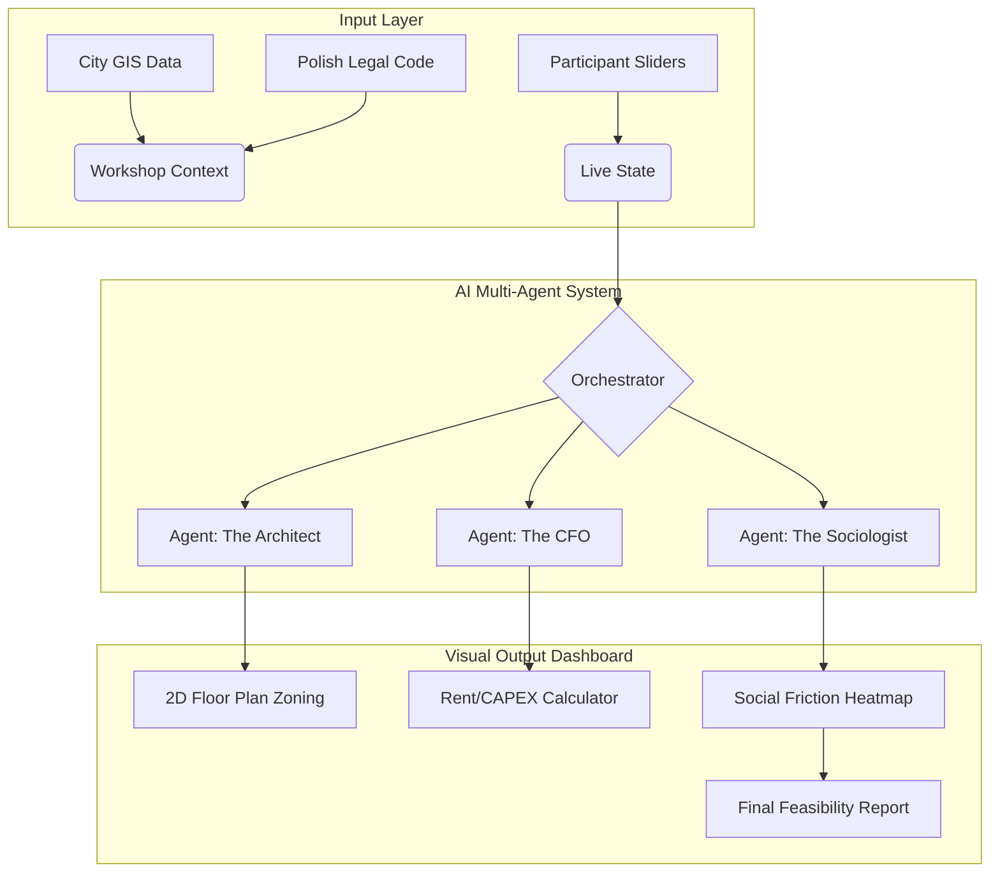

Here is the strategic response, rewriting the concept into the **"UrbanCore: The Civic AI Laboratory"** (Version 2.0) based on your file analysis and the goal of creating a 10/10 workshop for Polish municipalities.

***

# Executive Strategy: UrbanCore Workshop 2.0

**To:** Municipal Decision Makers & Innovation Teams
**From:** Lead AI Strategist & Urban Consultant
**Subject:** Moving from "Brainstorming" to "Parametric Feasibility" – Proposal for Workshop Upgrade.

I have reviewed the extracted data from your repository (*test_coliving1.pdf, sharedliving AI samorządy.pdf, etc.*). The current draft in `workshop_concept.md` is a solid **Version 1.0**—it captures the *empathy* and *narrative* aspects well.

However, to make this a "10/10" tool for Polish local governments, we must pivot from **"Talking to Personas"** to **"Simulating Urban Systems."** Municipalities don't just need stories; they need feasibility studies, budget estimates, and stress tests.

Below is the blueprint for **Version 2.0**, designed to be a rigorous, data-driven planning instrument.

---

## 1. Quick Diagnosis of Current State (The Gap)

* **Strengths identified in files:** The "Conflict Database" (*Space vs. Individual*) in `test_coliving1.pdf` is excellent intellectual property. The "Persona Chat" concept is engaging.
* **Weakness:** It is currently a "Black Box" creative writing exercise. It lacks constraints (Budget, Polish Law, Demographics).
* **The Pivot:** We will transform the AI from a **"Creative Writer"** to a **"Real-time Auditor & Simulator."**

---

## 2. The 2.0 Concept: "UrbanCore: The Civic AI Laboratory"

**Duration:** 4.5 Hours
**Format:** Hybrid Intelligence (10 Experts + Multi-Agent AI System)

### The New Agenda

#### **Module 1: Diagnosis & The "Invisible City" (45 min)**

* **Activity:** *Blind Date with Data.*
* **The Upgrade:** Instead of just asking AI personas what they feel, we ingest **GUS (Statistics Poland)** data.
* **AI Role:** *The Demographer.*
  * *Input:* Participants define a target group (e.g., "Young Professionals").
  * *AI Counter:* "Data Alert: In this district, 60% of residents are over 65. Your model lacks inclusivity for the dominant demographic."
  * *Output:* A heat map of actual local needs.

#### **Module 2: The Control Room (Parametric Design) (75 min)**

* **Activity:** *Sliding Scale Architecture.*
* **The Upgrade:** We digitize the tensions from `test_coliving1.pdf` into a dashboard of **Sliders**.
* **Mechanism:**
  * Participants adjust a slider: **"Integration" vs. "Privacy"**.
  * **Real-Time Feedback:** If they slide to "Max Integration":
        1. **AI Architect:** Shrinks private rooms by 15%, expands common kitchen.
        2. **AI Economist:** Lowers rental price by 10% (CAPEX efficiency) but increases operational risk (noise complaints).
* **Outcome:** A valid prototype with real trade-offs, not just a wish list.

#### **Module 3: The "Black Swan" Simulation (60 min)**

* **Activity:** *Resilience Stress-Test.*
* **The Upgrade:** Instead of a "Year in the Life" story, we run specific **Crisis Scenarios**.
* **AI Role:** *The Chaos Monkey.*
  * *Scenario A:* "Pandemic 2.0 (Lockdown)." How does your co-living sustain mental health?
  * *Scenario B:* "Inflation spike (+15% energy costs)." Can your rent model survive without evicting residents?
  * *Scenario C:* "The Bad Neighbor." A resident exploits the 'loose rules' you designed in Module 2.
* **Task:** Groups must patch their regulations ("Software") or building design ("Hardware") on the fly.

#### **Module 4: The Town Hall (Stakeholder Validation) (60 min)**

* **Activity:** *The NIMBY Defense.*
* **The Upgrade:** AI simulates the "Neighborhood Council" (Not In My Backyard).
* **AI Role:** *The Public Voice.*
  * Simulates 100 angry neighbors concerned about parking and noise.
  * Participants must pitch their solution. The AI scores their persuasion and factual accuracy.

---

## 3. Data & Analytics Layer (WorkshopsAI CMS 2.0)

To support this, the technical architecture analyzed in `Building AI-Powered...pdf` needs these specific upgrades:

1. **RAG (Retrieval-Augmented Generation) on Polish Law:**
    * Ingest *The Act on Protection of Tenants' Rights* and *Technical Conditions for Buildings*.
    * *Why?* So the AI can flag illegal ideas immediately (e.g., "You cannot build a bedroom without sunlight access in Poland").

2. **Conflict Prediction Model:**
    * Use the extracted text from `test_coliving1.pdf` to train a classifier that predicts friction points based on square footage per person.

3. **Metrics of Success (KPIs):**
    * **Social Impact Score:** (Reduction in loneliness vs. Cost).
    * **Feasibility Index:** (0-100% probability of passing City Council vote).

---

## 4. Visualizations & Artifacts

We need to generate high-value visuals to make the data digestible.

### Diagram: The Data Flow (Mermaid)

### Proposed Charts for the Dashboard

1. **The Trade-off Pentagon (Radar Chart):**
    * Axes: *Affordability, Privacy, Sustainability, Community Strength, Flexibility.*
    * Visualizes the "shape" of the group's proposal.
2. **Sentiment Simulation (Line Graph):**
    * Y-Axis: *Resident Satisfaction*.
    * X-Axis: *Timeline (Month 1-12)*.
    * Shows dips during the "Crisis Simulation" (Module 3).

---

## 5. Implementation Roadmap

Based on the files you have extracted, here is the immediate action plan:

1. **The "Conflict Database" (Priority):** Take the text from `test_coliving1.pdf` and convert it into a JSON dataset of *Cause -> Effect* pairs.
2. **The "Persona Chat" (Quick Win):** Implement the persona interaction as a warm-up, but frame it as "User Research" rather than the main event.
3. **The Report Generator (Value Add):** Code a template that takes the workshop inputs and generates a PDF titled *"Preliminary Co-Living Feasibility Study for [Municipality Name]"*.

**Final Verdict:** Implementing these changes transforms the workshop from an *educational game* into a **strategic urban planning tool**.

*Shall I provide the JSON structure for the "Conflict Database" or specific prompts for the "Chaos Monkey" simulator next?*
